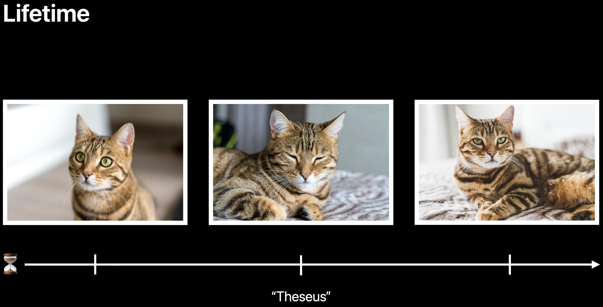
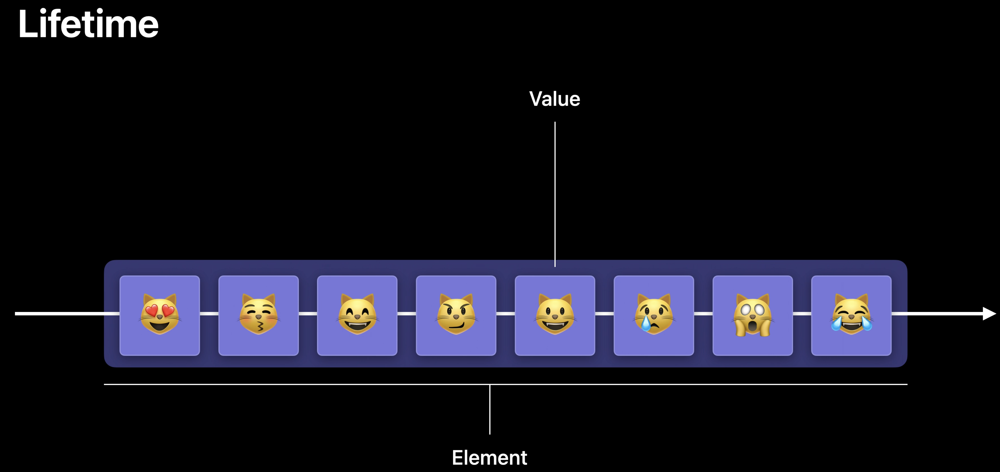
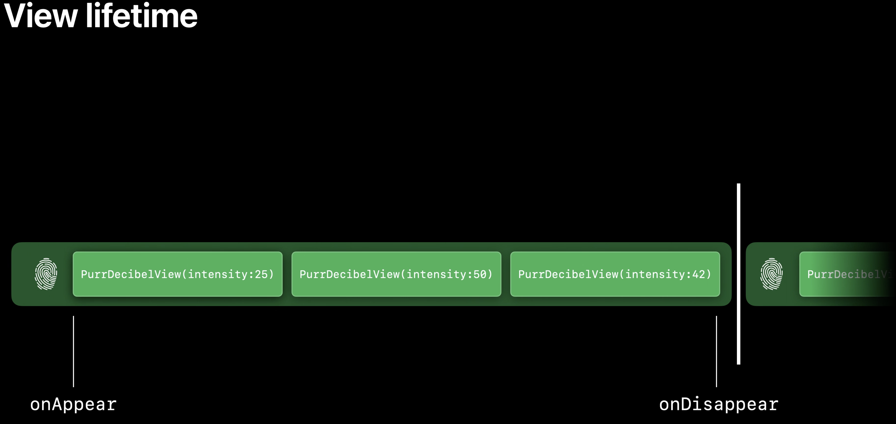
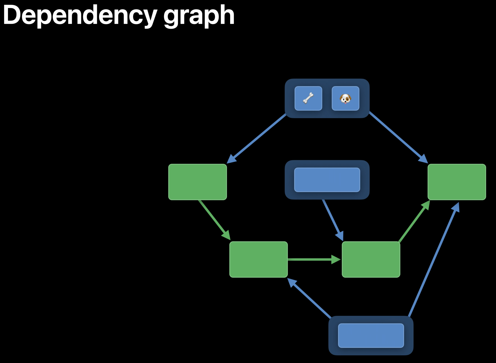

# Demystify SwiftUI

Presenters:
- Matt Ricketson, SwiftUI Engineer
- Luca Bernardi, SwiftUI Engineer
- Raj Ramamurthy, SwiftUI Engineer

## Intro

SwiftUI is a declarative UI framework. You describe what you want for your app
at a high level, and SwiftUI decides exactly how to make it happen. Most of the
time, this works great. But sometimes SwiftUI does something you might not
expect. It helps to understand what SwiftUI is doing behind the scenes to build
a better intuition for how to get the results you want.

When SwiftUI looks at your code, what does it see?

- Identity: how SwiftUI recognizes elements as the same or distinct across
  multiple updates of your app.
- Lifetime: how SwiftUI tracks the existence of views and data over time.
- Dependencies: how SwiftUI understands when your interface needs to be updated,
  and why.

These three concepts inform how SwiftUI decides what need to change, how, and
when.

## Identity

The question of whether things are the same or different.

For example, are these two different views, or the same view with different colors:


That distinction matters a great deal, because it changes how our interface
transitions from one state to another.

If the icons are different views, they should transition independently, such as
fading in and out.

If the icons are the same view, that implies the view should slide across the
screen during the transition, because it's the same view moving from one location
to another.

Connecting views across different states is important, because that's how SwiftUI
understands how to transition between them. This is the key concept behind
View Identity.

### View Identity

Views that share the same identity represent different states of the same conceptual
UI element. Views that represent distinct UI elements will always have different
identities.

Types of identity:
- Explicit identity: using custom or data-driven identifiers
- Structural identity: distinguishing views by their type and position in the
  view hierarchy

#### Explicit Identity

How can you figure out if two things are the same?

Ask for their names. If two things look the same and share the same name, it's
pretty likely they're the same thing. If they have different names, we can
guarantee that they are, in fact, different things.

Assigning names or identities are a form of explicit identifier.

One form of explicit identity is pointer identity. This is used across UIKit and
AppKit. SwiftUI doesn't use pointer identity, but learning about it helps better
understand how and why SwiftUI works differently.

In UIKit or App Kit view hierarchies, UIViews and NSViews are classes, so they
each have a unique pointer to their memory allocation. The pointer is a natural
source of explicit identity. We can refer to individual views just by using their
pointer. If two views share the same pointer, we can guarantee they're really
the same view.

SwiftUI doesn't use pointers because SwiftUI views are value types, commonly
represented as structs instead of classes.

In the SwiftUI Essentials talk from WWDC2019, we talked about why SwiftUI uses
value types for views; you can learn more from there. But the important things
are:

Views as value types
- Not allocated, no pointers
- Efficient memory representation
- Supports small, single-purpose components

Value types do not have a canonical reference that SwiftUI can use as a persistent
identity for its views. Instead, SwiftUI relies on other forms of explicit identity.

In this example:

```
// Explicit Identity in SwiftUI

List {
  Section {
    ForEach(rescueDogs, id: \.dogTagID) { rescueDog in
      ProfileView(rescueDog)
    }
  }
  Section("Status") {
    ForEach(adoptedDogs, id: \.dogTagID) { rescueDog in
      ProfileView(rescueDog, foundForeverHome: true)
    }
  }
}
```

The `\.dogTagID` parameter used here is a form of explicit identity. The `dogTagID`
of each rescueDog is used to explicitly identify its corresponding view in the
list. If the collection of rescueDogs changes, SwiftUI can use those ids to
understand what exactly changed, and generate the correct animations within the
list. In this case, SwiftUI was even able to correctly animate views moving
within different sections.

In a different example, using a scroll view reader to jump to the top of the view
using a button at the bottom:

```
// Explicit Identity in SwiftUI

ScrollViewReader { proxy in
  ScrollView {
    HeaderView(rescueDog)
      .id(HeaderID)

    Text(rescueDog.backstory)

    Button("Jump to Top") {
      withAnimation {
        proxy.scrollTo(headerID)
      }
    }
  }
}
```

The `.id(headerID)` modifier provides a way to explicitly identify a view using
a custom identifier; in this case, our header view at the top of the page. Then,
we can pass that identifier to the scroll view proxy's `scrollTo` method to tell
SwiftUI to go to that specific view.

What's great about this is that we don't have to explicitly identify every view.
Just the ones we need to refer to elsewhere in the code, like our header text.
By comparison, the `ScrollViewReader`, `ScrollView`, backstory `Text`, and `Button`
do not need explicit identifiers.

But just because their identity isn't explicit, that doesn't mean these views
have no identity at all. Every view has an identity, even if it's not explicit.

#### Structural Identity

This is where structural identity comes in. SwiftUI uses the structure of your
view hierarchy to generate implicit identities for your views, so you don't
have to.

We can use the relative arrangement of our subjects to distingtuish them from
one another. That's structural identity.

SwiftUI leverages structural identity throughout its API. A classic example is
when you use `if` statements and other conditional logic within your view code.
The structure of the conditional statement gives us a clear way to identify
each view. The first view only shows when the condition is true, while the second
view only shows when the condition is false:

```
// Structural Identity in SwiftUI

var body: some View {
  if rescueDogs.isEmpty {
    AdoptionDirectory(selection: $rescueDogs)
  } else {
    DogList(rescueDogs)
  }
}
```

That means we can always tell which view is which, even if they happen to look
similar. However, this only works if SwiftUI can statically guarantee that these
views stay where they are never swap places.

SwiftUI accomplishes this by looking at the type structure of your view hierarchy.
When SwiftUI looks at your views, it sees their generic types. In this case, our
`if` statement translates into a conditional content view, which is generic over
its true and false content. This translation is powered by a `@ViewBuilder`, which
is a type of result builder in Swift.

The view protocol implicitly wraps its body property in a view builder, which
constructs a single, generic view from the logic statements in our property. The
`some View` return type of our body property is a placeholder that represents
the static, composite type, hiding it away so it doesn't clutter up our code:

```
some View =
  _ConditionalContent<
    AdoptionDirectory,

    DogList
  >
```

Using this generic type, SwiftUI can guarantee that the `true` view will _always_
be the `AdoptionDirectory`, while the `false` view will _always_ be the `DogList`,
allowing them to be assigned an implicit, stable identity behind the scenes.

This is the key to the Good Dog/Bad Dog app from earlier; there are two ways to
set up this view:

```
VStack {
  if dog.isGood {
    PawView(tint: .green)
    Spacer()
  } else {
    Spacer()
    PawView(tint: .red)
  }
}
```

This represents the true/false view, where logic represents different branches
that represent views with distinct identities.

Or you could set it up as a single view, where the conditional changes its layout
and color. In this case, we're modifying a single view, with a consistent identity:

```
PawView(tint: dog.isGood ? .green : .red)
  .frame(
    maxHeight: .infinity,
    alignment: dog.isGood ? .top : .bottom
    )
```

Both of these work, but SwiftUI recommends the second. This helps preserve your
view's lifetime and state.

Now that we understand structural identity, we need to understand its nemesis:
`AnyView`.

#### AnyView

This is a helper function that gets a view that represents a dog's breed. Each
conditional branch in the function returns a different kind of view, so I've
wrapped them all in `AnyView`s, because Swift requires a single return type for
the whole function. Unfortunately, this also means that SwiftUI can't see the
conditional structure of the code. Instead, it just sees an `AnyView` as a return
type of the function:

```
// AnyView

func view(for dog: Dog) -> some View {
  var dogView: AnyView
  if dog.breed == .bulldog {
    dogView = AnyView(BulldogView())
  } else if dog.breed == .pomeranian {
    dogView = AnyView(PomeranianView())
  } else if dog.breed == .borderCollie {
    dogView = AnyView(BorderCollieView())
    if sheepNearby {
      dogView = AnyView(HStack {
        dogView
        SheepView()
        })
    }
  } else {
    dogView = AnyView(UnknownBreedView())
  }
  return dogView
}
```

This is because `AnyView` is a type-erasing wrapper type. It hides the type of view
it is wrapping from its generic signature.

This code is also just really hard to read. Let's try to simplify the code and
make more of its structure visible to SwiftUI:

First, it looks like this branch is conditionally adding a `SheepView()` alongside
our `BorderCollieView()` if there are sheep nearby. We can simplify this by
conditionally adding the view inside the HStack, rather than conditionally adding
the HStack around our views:

```
  ...
  } else if dog.breed == .borderCollie {
    dogView = AnyView(HStack {
      BorderCollieView()
      if sheepNearby {
        SheepView()
      }
    })
  } else {
  ...
```

With that change, we can see that we're just returning a single view from each
branch, so our local `dogView` variable isn't necessary. Instead, we can replace
it with return statements inside of each branch:

```
// AnyView

func view(for dog: Dog) -> some View {
  var dogView: AnyView
  if dog.breed == .bulldog {
    return AnyView(BulldogView())
  } else if dog.breed == .pomeranian {
    return AnyView(PomeranianView())
  } else if dog.breed == .borderCollie {
    return AnyView(HStack {
      BorderCollieView()
      if sheepNearby {
        SheepView()
      }
    })
  } else {
    return AnyView(UnknownBreedView())
  }
}
```

As we saw earlier, normal SwiftUI view code can use if statements that return
different types of views. But if we try deleting the AnyViews from our code, we
see some errors and warning appear. This is because SwiftUI requires a single
return type from our helper function. So how can we avoid these errors?

Recall that the body property of a view is special, because the view protocol
implicitly wraps it in the `@ViewBuilder`. This translates the logic in the property
into a single, generic view structure.

Swift does not infer helper functions to be ViewBuilders by default, but we can
opt into that by manually applying the `@ViewBuilder` property ourselves. That
allows us to remove the return statements and AnyViews, making our code easier
to read and understand:

```
// View Builders

@ViewBuilder
func view(for dog: Dog) -> some View {
  if dog.breed == .bulldog {
    BulldogView()
  } else if dog.breed == .pomeranian {
    PomeranianView()
  } else if dog.breed == .borderCollie {
    HStack {
      BorderCollieView()
      if sheepNearby {
        SheepView()
      }
    }
  } else {
    UnknownBreedView()
  }
}
```

If we look at the type signature of the result, it now exactly replicates the
conditional logic of our function with a tree of conditional content, providing
SwiftUI with a much richer perspective of the view and the identities of its
components:

```
some View =
  _ConditionalContent<
    _ConditionalContent<
      BulldogView,
      PomeranianView
    >,
    _ConditionalContent<
      HStack<
        TupleView<(
          BorderCollieView,
          SheepView?
        )>
      >,
      UnknownBreedView
    >
  >
```

But there's one more improvement we can make. The top level of our function is
just matching against different cases of the dog's breed. This seems like an
excellent use case for a switch statement, which are also supported by view
builders:

```
// View Builders

@ViewBuilder
func view(for dog: Dog) -> some View {
  switch dog.breed {
  case .bulldog:
    BulldogView()
  case .pomeranian:
    PomeranianView()
  case .borderCollie:
    HStack {
      BorderCollieView()
      if sheepNearby {
        SheepView()
      }
    }
  default:
    UnknownBreedView()
  }
}
```

In general, we recommend avoiding `AnyView`s whenever possible because:
- Makes code harder to understand
- Fewer compile-time diagnostics
- Worse performance when not needed

## Lifetime

It's very intuitive for us to think that once we name our favorite pet, it will
always be the same adorable cat as it moves through different states throughout
the day. When we look at him one moment, he might be sleepy, and a moment later,
being a proper cat, he might be annoyed at my presence - but he'll always be
"Theseus":



This is the essence of connecting identity to lifetime. Identity allows us to
define a stable element for a different value over time. In other words, it
allows us to introduce continuity over time:



How does this apply to SwiftUI?

Our views are in different states throughout their lifetime. Every single state
is a different value for our view. Identity connects these different values as a
single entity - a view - over time. Let's look at some code to clarify this.

This represents a simple view that displays the intensity of purring:

```
struct PurrDecibelView: View{
  var intensity: Double

  var body: some View {
    // ...
  }
}
```

Through the evaluation of body, SwiftUI will create new values for this view.
In this case, with intensity value of 25:

```
  var body: some View {
    PurrDecibelView(intensity: 25)
  }
```

Theseus is getting angry and wants more attention. Body is invoked again with the
higher intensity, and a new value for this view is created:

```
  var body: some View {
    PurrDecibelView(intensity: 50)
  }
```

These are two distinct values created from the same view definition. SwiftUI will
keep around a copy of the body to perform a comparison and know that the view is
changed, but after that, the view is destroyed.

What's important to understand here is that the view value is different from the
view identity. View values are ephemeral, and you should not rely on their lifetime,
but what you can control is their identity.

When a view is first created and it appears, SwiftUI assigns it an identity, using
a combination of the techniques discussed before. Over time, driven by updates,
new values for the view are created, but from SwiftUI's perspective, these
represent the same view. Once an entity of the view changes, or the view is
removed, its lifetime ends:



Whenever we talk about the lifetime of the view, we are talking about the duration
of the identity associated with that view. Being able to connect the identity of
a view with its lifetime is fundamental to understanding how SwiftUI persists
your state. Let's bring state and state object into the picture:

When SwiftUI is looking at your view and sees a state or state object, it knows
that it needs to persist that piece of data throughout the view lifetime:

```
struct CatRecorder: View {
  @State var title = ""

  @StateObject var mic = Microphone()

  var body: some View {
    VStack {
      TextField("Title": text: $title)
      MicView(mic)
    }
  }
}
```

In other words, state and state object are the persistent storage associated with
your view's identity.

At the beginning of your view's identity, when it's created for the first time,
SwiftUI allocates storage in memory for state and stateObject using their initial
values.

Throughout the lifetime of the view, SwiftUI will persist this storage as it
gets mutated, and the view's body is re-evaluated.

Whenever identity changes, the state is replaced. This deallocates the original
state and creates new state. Then, if you were to go back to the first view,
the original memory allocated for that view has been deallocated, so state does
not persist from that view.

In short: State lifetime = View lifetime.

This gives us the ability to clearly separate what is the essence of a view, its
state, and tie that to its identity. Everything else can be derived from it.

SwiftUI has a set of data-driven constructs that use the identity of your data
as a form of explicit identity for your views:

- `ForEach`
- `confirmationDialog()` / `alert()`
- `List` / `Table` / `OutlineGroup`

### Initializing ForEach

Let's look at the ways you can initialize `ForEach`:

#### Constant range

The simplest way to initialize a `ForEach` is one that takes a constant range:

```
// 💤

ForEach(0..<5) { offset in
  Text("🐑 \(offset)")
}
```

You'll see an error to use this initializer with a dynamic range.

#### Dynamic range

This initializer takes a collection and a key path to a property serving as an
identifier. This property must be `Hashable` because SwiftUI will use its value to
assign an identity to all the views generated from the element of the collection:

```
struct RescueCat {
  // ...
  var tagID: UUID
}


ForEach(rescueCats, id: \.tagID) { rescueCat in
  ProfileView(rescueCat)
}
```

Choosing a stable identity affects the performance and correctness of your app.
This is so important that the standard library defines the `Identifiable` protocol
to describe this capability. SwiftUI takes full advantage of this protocol.

When looking at the definition of the initializer we're using here:

```
extension ForEach
  where Content: View, Data.Element: Identifiable, ID == Data.Element.ID
  {
    public init(
      _ data: Data,
      @ViewBuilder content: @escaping (Data.Element) -> Content
      )
  }
```

There are a lot of interesting things here:
- `ForEach` needs two main pieces; a collection, here indicated by the generic
  argument `_ data: Data`, and a way to generate a view from each element of the
  collection.
- `ForEach` defines a relationship between a collection of data and a collection of
  views.
- We constrain the element of the collection to be `Identifiable`. The purpose of
  the `Identifiable` protocol is to allow for your type to provide a stable notion
  of identity, so SwiftUI can keep track of your data throughout its lifetime.

Choosing a stable identifier is your opportunity to control the lifetime of your
view and data.

## How SwiftUI updates the UI

Here's a simple view:

```
// A simple view
struct DogView: View {
  @Binding var dog: Dog
  var treat: Treat

  var body: some View {
    Button {
      dog.reward(treat)
    } label: {
      PawView()
    }
  }
}
```

It shows a button that rewards a dog with a treat.

There are two properties; one for a `dog`, and another for a `treat`. These
properties are dependencies of a view. Dependencies are just input to a view.

When a dependency changes, a view is required to produce a new body.

Body is where you build a hierarchy for a view. Here, we have a button with an
action. Actions are what trigger changes to a view's dependencies.

The dependency graph is an important structure, because it allows SwiftUI to
efficiently update only those views that require a new body.



When the dependency changes, only those views are invalidated. SwiftUI calls each
view's body, producing a new body value for each view. SwiftUI will instantiate
the values of each invalidated view's body. That may result in more dependencies
changing, but not always.

Because views are value types, SwiftUI can efficiently compare them to only update
the right subset of views.

The Identity is the backbone of the dependency graph.

Dependency graph:
- Is an underlying representation of SwiftUI views
- Identity is the backbone of the graph
- Efficiently updates the UI
- Value comparison reduces body generation

### Identifier stability

The lifetime of a view is the duration of its identity. That means the stability
of an identifier is crucial. An identity that isn't stable could result in a
shorter view lifetime. Having a stable identifier also helps performance, since
SwiftUI doesn't need to continually create storage for the view and churn through
updating the graph. Also important for avoiding loss of state.

Here's a view of favorite pets. But there's a bug - everytime we add a new pet,
everything on screen flashes:

```
enum Animal { case dog, cat }

struct Pet: Identifiable {
  var name: String
  var kind: Animal
  var id: UUID { UUID() }
}

struct FavoritePets: View {
  var pets: [Pet]
  var body: some View {
    List {
      ForEach(pets) {
        PetView($0)
      }
    }
  }
}
```

The bug is in the `Identifiable` conformance, at the line: `var id: UUID { UUID() }`.
This isn't stable. Anytime the data changes, we get a new identifier.

Instead, we could use a persistent identifier, like one from a database:

```
struct FavoritePets: View {
  var pets: [Pet]
  var body: some View {
    List {
      ForEach(pets, id: \.databaseID) {
        PetView($0)
      }
    }
  }
}
```

### Identifier uniqueness

Another property of good identifiers is uniqueness. Each identifier should map to
a single view. This is important because it:

- Improves animations
- Helps performance
- Correctly reflects dependencies

In this example, we're working on a view with all of the pet's favorite treats:

```
struct TreatJar: View {
  var treats: [Treat]

  var body: some View {
    ScrollView {
      LazyVGrid(...) {
        ForEach(treats, id: \.name) {
          TreatCell($0)
        }
      }
    }
  }
}
```

Each treat has a name, an emoji, and an expiration date. I've chosen to identify
each treat based on its name.

What happens when we have more than one of the same treat? When we add them to
the jar, they might not show up. The name of a treat isn't a unique identifier.
Instead, we could use a serial number or another unique id:

```
      ...
        ForEach(treats, id: \.serialNumber) {
          TreatCell($0)
      ...
```

This ensures that all the right data is shown in the jar. It also ensures better
animations and better performance.

### Structural identity

Here we have a view that compares a treat's expiration date with today's date.
If the treat is expired, the view dims the cell:

```
ForEach(treats, id: \.serialNumber) { treat in
  TreatCell(treat)
    .modifier(ExpirationModifier(date: treat.expiryDate))
}

struct ExpirationModifier: ViewModifier {
  var date: Date
  func body(content: Content) -> some View {
    if date < .now {
      content.opacity(0.3)
    } else {
      content
    }
  }
}
```

There's a subtle bug here: if the condition changes and the treat expires, we
end up with a new identity. The if statement represents a branch. The branch is a
type of structural identity. This means that we have two copies of the content,
instead of a single, optionally-modified copy.

In your project, you might have branches like this across files without even
being aware of it. How can we avoid this?

One way is to fold the branches together, and move the condition inside the
opacity modifier:

```
struct ExpirationModifier: ViewModifier {
  var date: Date
  func body(content: Content) -> some View {
    content.opacity(date < .now ? 0.3 : 1.0)
  }
}
```

Now, when the condition changes, only the opacity needs to change. It doesn't
change the entire view's identity.

When you introduce a branch, pause for a second and think about whether you're
representing multiple views, or two states of the same view. It often works better
to use an inert modifier instead of a branch to modify a single view.
