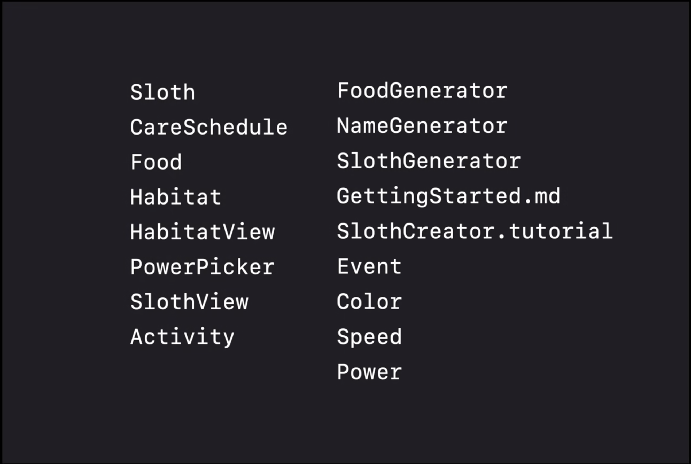
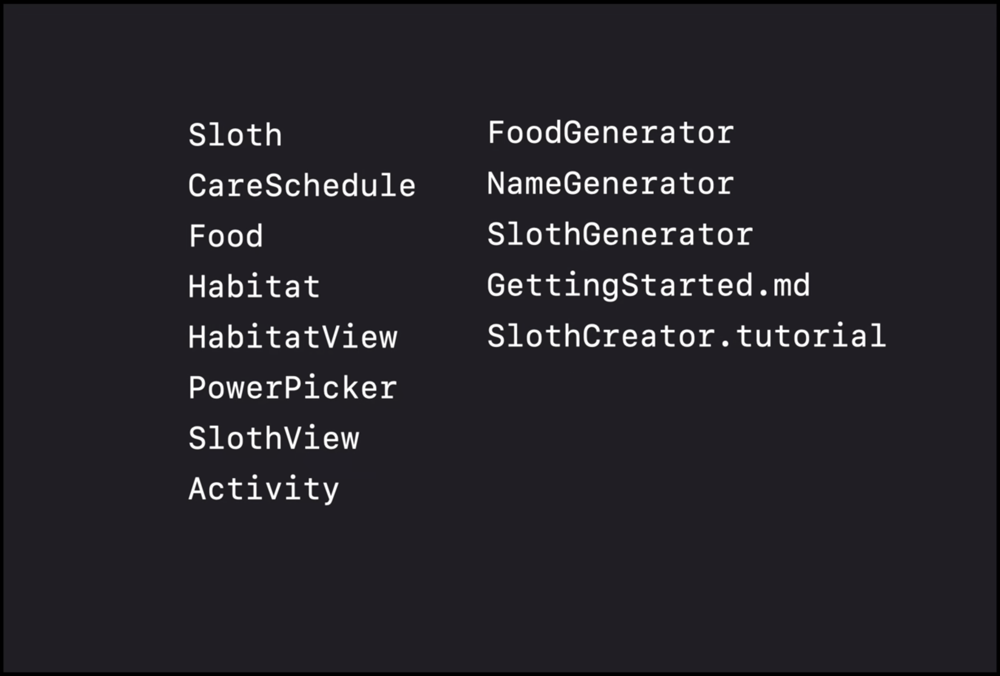
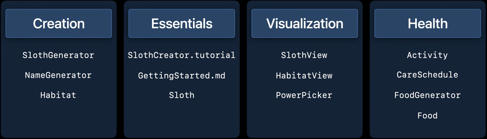
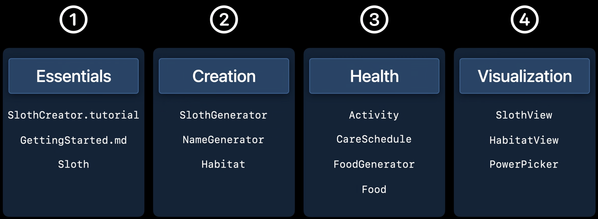

# Elevate your DocC documentation in Xcode

Presenters:
- Beatriz Magalhães, Human Interface Designer
- Jack Lawrence, Software Engineer

## Page Types

Xcode 13 has a brand-new feature called Documentation Catalog. You can create
three page types you can view on the Documentation Window or on the web:
- *Reference:* provides concise, in-depth information about individual APIs in
  your library. This allows you to add text descriptions, code snippets, and
  relationships between different symbols.
- *Articles:* pages with freeform content. They give a big picture about how the
  framework works, and explaining how to completing specific tasks. They
  connect the dots between different symbols.
- *Tutorials:* step-by-step walkthrough of a project that uses your framework.
  It's great to understand how a combination of symbols work together by
  implementing it in practice.

In this session, we'll focus on articles. For information about other page types,
see:
- Meet DocC Documentation in Xcode
- Build interactive tutorials using DocC

### Set up a Documentation Catalog

To add an article, you must have a Documentation Catalog. Documentation Catalog
is a file in the Xcode Navigator that contains all the documentation files. It
allows you to add new page types.

1. Right-click on framework sources directory, and select `New File`.
2. Scroll to `Documentation Catalog`, and select it. Press the `Next` button.
3. Name it to match your target. In example, SlothCreator.
4. Xcode gives you a top-level article when you create a Documentation Catalog.
   Rename it.

### Top-Level Articles

Use a top-level article to explain at a glance what your framework does.

Top-level articles have:
- A concise summary sentence
- An overview, with content like images and code snippets
- A Topics section, with a few symbols you want to highlight

### Task Article

Similar to top-level article. Both types can include text, images, and code
snippets. The difference is in the content.

In the example, the task article provides context around how to create a sloth
by describing its properties and traits. It also gives actionable steps about
how to care for the sloth, and provide a suitable habitat. Enables users to
adopt SlothCreator faster.

### Writing an Article

- Write in Markdown
- Insert text into the template
- Add images
  - 2x in resolution
  - Either dark-mode compatible, or have a dark-mode alternative
  - Include the proper naming conventions
    - `filename~viewmode@scalefactor.fileformat`  - example: `sloth~dark@2x.png` or
      `sloth~light@2x.png`
  - Open Finder, drag assets into the Resources folder of Documentation Catalog
  - Add the image to article Markdown

### Use other tools to author articles

You can prepare articles outside of Xcode, and drag them into your Documentation
Catalog.

1. Open Finder, and drag the markdown file into the Documentation Catalog.
2. Build the documentation again.

## Organization

Xcode's overview page automatically groups together related topics. You can
take a step back and look at the story you want to tell, and organize your APIs
accordingly.

For SlothCreator, API context is around three main concepts:
- Researching and creating sloths
- Caring for the health and happiness of your sloth
- Viewing your sloth in its habitat

Can use these categories to organize the documentation pages in SlothCreator.

Inventory top-level pages.



Put aside all but the most important pages. Can organize supporting types, like
Speed and Color, under another page later.



Next, organize remaining pages into groupings centered around the features of
SlothCreator:



Sort the groups and pages from least to most advanced:



The documentation is more approachable, and framework adopters will know where
to go to find information about each section.

### Customize markdown file to organize topic section

- Update Group titles in the third-level heading
- Add list of articles for the group
  - To link to article: - `<doc:NameOfArticle>`
  - To link to symbol, use the symbol name surrounded by double backticks \`\`

Example:

```
## Topics

### Essentials

- <doc:GettingStarted>
- ``Sloth``

### Creating Sloths

- ``SlothGenerator``
- ``NameGenerator``
- ``Habitat``

...
```

Then, rebuild documentation to view changes.

Compiler can warn you if you typo something and one of the links to the symbols
doesn't work. Use autocomplete to get the correct name, and rebuild to verify
no more compiler warnings.

Documentation ToC on the left updates to match MD.

### To create a Topics section

Add a `## Topics` heading to any page. This creates a "Topics" section.

Add third-level headings to organize content within the "Topics" section. You
can add this to any page.

## Extensions

Give you the flexibility to choose how you write documentation for your APIs.

Could add a custom Topics section in the source code. But might be easier to
review and maintain over time if additional documentation was in a separate file.

Can use a documentation extension to do this.

1. Create a new markdown file. Associate it with the API using link syntax in
   the title.
2. Leave the primary content, like the summary and discussion in the code, and
   extract the topic section.
3. When DocC builds, it merges each source comment and corresponding documentation
   extension into a single documentation page.

### To create an extension

1. Right-click the Documentation Catalog in the navigator, and select `New File`.
2. Scroll to `Documentation` -> `Extension File`, and select it. Press the `Next`
   button.
3. Name it.
4. Connect the extension file to the type using a link in the title. Include the
   name of the module in the URL. For example: `# ``SlothCreator/Sloth```
5. Rebuild the documentation to view the result.

## Sharing the documentation

- People who use the framework can build the documentation right in Xcode
- You can export and share the .doccarchive
- You can host it on the web; see: Host and automate your DocC documentation
