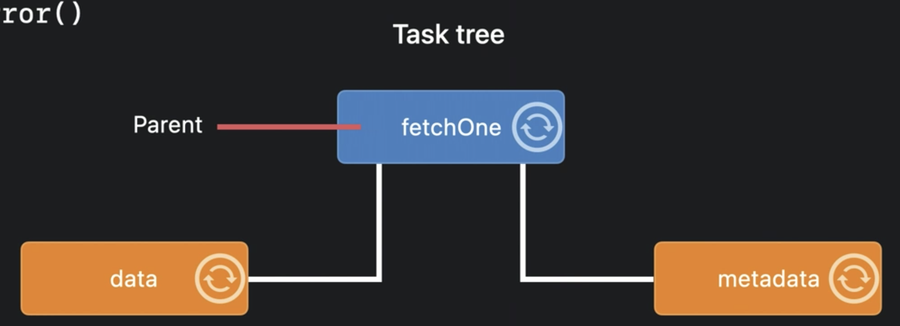
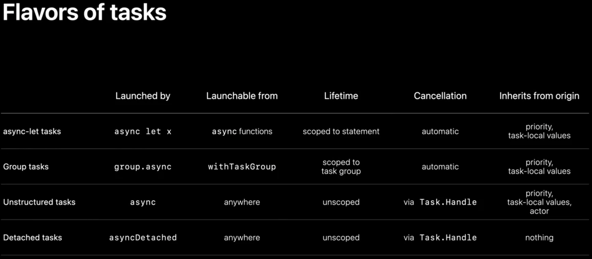

# Explore structured concurrency in Swift

Presenters:

Kevon?

## Structured Concurrency is based on Structured Programming

Structured programming with static scope makes control flow and variable lifetime
easy to understand.

More generally, structured control flow can be sequenced and nested together
naturally. This lets you read your entire program top-to-bottom.

Async and concurrent code hasn't been able to use structured programming

For example:

```
// Asynchronous code with completion handlers is unstructured.

func fetchThumbnails(for ids: [String],
                      completion handler: @escaping ([String: UIImage]?, Error?) -> Void) {
  guard let id = ids.first else {return handler([:], nil)}
  let request = thumbnailURLRequest(for: id)
  URLSession.shared.dataTask(with: request) { data, response, error in
    guard let response = response,
          let data = data
    else {
      return handler(nil, error)
    }
    // ... check response ...
    UIImage(data: data)?.prepareThumbnail(of: thumbSize) { image in
      guard let image = image else {
        return handler(nil, ThumbnailFailedError())
      }
      fetchThumbnails(for: Array(ids.dropFirst())) { thumbnails, error in
        // ... add image to thumbnails ...
      }
    }
  }
}
```

Rewriting this code to use async/await syntax based on structured programming:

```
// Asynchronous code with async/await is structured.

func fetchThumbnails(for ids: [String]) async throws -> [String: UIImage] {
  var thumbnails: [String: UIImage] = [:]
  for id in ids {
    let request = thumbnailURLRequest(for: id)
    let (data, response) = try await URLSession.shared.data(for: request)
    try validateResponse(response)
    guard let image = await UIImage(data: data)?.byPreparingThumbnail(ofSize: thumbSize) else {
      throw ThumbnailFailedError()
    }
    thumbnails[id] = image
  }
  return thumbnails
}
```

We can now loop over the thumbnails to process them synchronously. We can also
throw errors.

What if we need to process thousands of thumbnails? And what if the size is retrieved
from another URL instead of being fixed? This is a good opportunity to introduce
Tasks.

A task provides a new async context for executing code concurrently.
- Each task runs concurrently with respect to other execution contexts
- They are automatically scheduled to run in parallel when it is safe and efficient
  to do so
- Because tasks are deeply integrated into Swift, the compiler can help prevent
  some concurrency bugs
- Calling an async function does not create a new task for the call. You create
  tasks explicitly.

## Types of Structured Concurrency Tasks in Swift

### Async-let tasks

Sequential bindings

```
let result = URLSession.shared.data(...)
```

Two parts:
1. The initializer expression on the right side of of the `=`
2. The variable's name on the left

There may be other statements before or after the `let`.

Once Swift reaches a `let` binding, its initializer is evaluated to produce
a value. In this example, that means downloading data from a URL, which could
take a while. After the data has been downloaded, Swift will bind that data to
the variable name before proceeding to the statements that follow.

Because the download could take a while, you could let the program start downloading
the data and keep doing other work until the data is needed. To do this, add the
`async` keyword in front of an existing `let` binding. This turns it into a
concurrent binding called `async let`.

The evaluation of a concurrent binding is quite different from a sequential
binding.

To evaluate a concurrent binding, Swift will create a new child task, which is
a subtask of the one that created it. Because every task represents an execution
context for your program, two arrows will simultaneously come out of the step:

1. The first arrow is for the child task, which will immediately begin downloading
   the data.
2. The second arrow is for the parent task, which will immediately bind the variable
   result to a placeholder value. The parent task is the same one that was executing
   the preceeding statements.

While the data is being downloaded concurrently by the child, the parent task
continues to execute the statements that follow the concurrent binding. But, upon
reaching an expression that needs the actual value of the result, the parent will
await the completion of the child task, which will fulfill the placeholder for result.

Now, we can restructure the fetch thumbnail code:

```
// With sequential bindings

func fetchOneThumbnail(withID id: String) async throws -> UIImage {
  let imageReq = imageRequest(for: id), metadataReq = metadataRequest(for: id)
  let (data, _) = try await URLSession.shared.data(for: imageReq)
  let (metadata, _) = try await URLSession.shared.data(for: metadataReq)
  guard
    let size = parseSize(from: metadta),
    let image = await UIImage(data: data)?.byPreparingThumbnail(ofSize: size)
  else {
    throw ThumbnailFailedError()
  }
  return image
}
```

This new function downloads data from two different URLs: one for the image itself,
and the other for metadata. Note that with the sequential binding, you write `try
await` on the right side of the `let` because that's where an error or suspension
would be observed.

To make both downloads happen concurrently, you write `async` in front of both
of these `lets`:

```
// Structured concurrency with async-let

func fetchOneThumbnail(withID id: String) async throws -> UIImage {
  let imageReq = imageRequest(for: id), metadataReq = metadataRequest(for: id)
  async let (data, _) = URLSession.shared.data(for: imageReq)
  async let (metadata, _) = URLSession.shared.data(for: metadataReq)
  guard
    let size = parseSize(from: try await metadta),
    let image = try await UIImage(data: data)?.byPreparingThumbnail(ofSize: size)
  else {
    throw ThumbnailFailedError()
  }
  return image
}
```

Since the downloads are now happening in child tasks, you no longer write `try await`
on the right side of the concurrent binding. Those effects are only observed by
the parent tasks when using the variables that are concurrently bound, so you write
`try await` before the expressions reading the metadata and the image data.

Also, notice that using these concurrently bound variables does not require a method
call or any other changes. Those variables have the same type that they did in a
sequential binding.

These child tasks are actually part of a hierarchy called a task tree. This tree
is not just an implementation detail; it's am important part of structured
concurrency. It influences the attributes of your tasks, like cancellation,
priority, and task-local variables.

Whenever you make a call from one async function to another, the same task is
used to execute the call.

So the function `fetchOneThumbnail` inherits all attributes of that task.

When creating a new structured task, like with `async let`, it becomes the child
of the task that the current function is running on. Tasks are not the child of
a specific function, but their lifetime may be scoped to it.



The tree is made up of links between each parent task and its child tasks. A link
enforces a rule that says a parent task can only finish its work if all of its
child tasks have been completed. This rule holds even in the face of abnormal
control flow which would prevent a child task from being awaited.

For example, in this code, we first await the metadata task before the image data
task. If the first awaited task finished by throwing an error, the fetchOne
function must immediately exit by throwing that error. But what happens to the task
performing the second download?

During the abnormal exit, Swift automatically marks the unawaited task as canceled,
and then await for it to finish, before exiting the function. Marking the task as
canceled does not stop the task. It simply informs the task that its results are
no longer needed.

When a task is canceled, all of the subtasks that are a descendent of that task
are canceled, too. So if the implementation of URLSession created its own
structured tasks to download the image, those tasks will be marked for cancellation.

The function finally exits by throwing the error once all of the structured tasks
it created, directly or indirectly, have finished.

This guarantee is fundamental to structured concurrency. It prevents you from
accidentally leaking tasks by helping you manage their lifetimes, much like how
arc automatically manages the lifetime of memory.

#### Cooperative cancellation

So far, we've looked at how cancellation propagates. But when do canceled tasks
actually stop? If the task is in the middle of an important transaction, or has
open network connections, it would be incorrect to just halt the task. That's why
task cancellation in Swift is cooperative. Your code must check for cancellation
explicitly, and wind down execution in whatever way is appropriate.

Check the cancellation status of the current task from any function, whether it's
async or not. You should implement APIs with cancellation in mind; especially if
it involves long-running computation.

Example of cancellation checking:

```
// Cancellation checking

func fetchThumbnails(for ids: [String]) async throws -> [String: UIImage] {
  var thumbnails: [String: UIImage] = [:]
  for id in ids {
    try Task.checkCancellation()
    thumbnails[id] = try await fetchOneThumbnail(withID: id)
  }
  return thumbnails
}
```

If this function was called within a task that was canceled, we don't want to keep
processing thumbnails. This call checks cancellation at the start of each loop
iteration. This call only throws an error if the current task has been canceled.

You can also obtain the cancellation status of the current task as a Bool if that's
more appropriate for your code.

```
// Cancellation checking

func fetchThumbnails(for ids: [String]) async throws -> [String: UIImage] {
  var thumbnails: [String: UIImage] = [:]
  for id in ids {
    if Task.isCancelled { break }
    thumbnails[id] = try await fetchOneThumbnail(withID: id)
  }
  return thumbnails
}
```

### Group Tasks

`async-let` works well when there's a fixed amount of concurrency available.

`async-let` is scoped like a variable binding. That means the two child tasks in
the `fetchOneThumbnail` example must complete before the next loop iteration
begins.

But what if we want this loop to kick off tasks to fetch all of the
thumbnails concurrently? The amount of concurrency is not known statically because
it depends on the number of IDs in the array. The right tool for this situation
is a task group.

A task group is a form of structured concurrency that is designed to provide a
dynamic amount of concurrency.

You can introduce a task group by calling the `withThrowingTaskGroup` function.
This function gives you a scope to group object to create child tasks that are
allowed to throw errors. Tasks added to a group cannot outlive the scope of the
block in which the group is defined. Since we've placed the entire for loop inside
the block, we can create a dynamic number of tasks using the group.

```
// A task group is for concurrency with dynamic width

func fetchThumbnails(for ids: [String]) async throws -> [String: UIImage] {
  var thumbnails: [String: UIImage] = [:]
  try await withThrowingTaskGroup(of: Void.self) { group in
    for id in ids {
      thumbnails[id] = try await fetchOneThumbnail(withID: id)
    }
  }
  return thumbnails
}
```

You create child tasks in the group by invoking its async method.

```
// A task group is for concurrency with dynamic width

func fetchThumbnails(for ids: [String]) async throws -> [String: UIImage] {
  var thumbnails: [String: UIImage] = [:]
  try await withThrowingTaskGroup(of: Void.self) { group in
    for id in ids {
      group.async {
        thumbnails[id] = try await fetchOneThumbnail(withID: id)
      }
    }
  }
  return thumbnails
}
```

Once added to a group, child tasks begin executing immediately, and in any order.
When the group object goes out of scope, the completion of all tasks within it will
be implicitly awaited. This is a consequence of the task tree rule we learned earlier,
because group tasks are structured, too.

You can use `async let` within group tasks, or create task groups within `async let`
tasks, and the levels of concurrency in the tree compose naturally.

If we try to run this code, we'll get a compiler error alerting us to a data
race issue. The problem is that we're trying to insert a thumbnail into a single
dictionary from each child task. This is a common mistake when increasing the amount
of concurrency in your program: data races are accidentally created.

This dictionary cannot handle more than one access at a time. If two child tasks
tried to insert thumbnails simultaneously, that could cause a crash or data
corruption. Swift provides static checking to prevent those bugs.

#### Data-race safety

- Task creation takes a `@Sendable` closure
- Cannot capture mutable variables
- Should only capture value types, actors, or classes that implement their own
  synchronization

See also:
- Protect mutable state with Swift actors

To avoid the data race in our example, you could have each child task return a
value. This design gives the parent task the sole responsibility of processing the
results. In this case, we specify that each child task must return a tuple containing
the string ID and UI Image for each thumbnail. Then, inside each child task,
instead of writing to the dictionary directly, we have them return the key-value
tuple for the parent to process.

```
// Accessing the results of tasks within a group

func fetchThumbnails(for ids: [String]) async throws -> [String: UIImage] {
  var thumbnails: [String: UIImage] = [:]
  try await withThrowingTaskGroup(of: (String, UIImage).self) { group in
    for id in ids {
      group.async {
        return (id, try await fetchOneThumbnail(widthID: id))
      }
    }
  }
  return thumbnails
}
```

The parent task can iterate through the results from each child task using the
new `for...await` loop. The `for...await` loop obtains the results from the child
task in order of completion. Because this loop runs sequentially, the parent task
can safely add each key-value pair to the dictionary.

```
// Accessing the results of tasks within a group

func fetchThumbnails(for ids: [String]) async throws -> [String: UIImage] {
  var thumbnails: [String: UIImage] = [:]
  try await withThrowingTaskGroup(of: (String, UIImage).self) { group in
    for id in ids {
      group.async {
        return (id, try await fetchOneThumbnail(widthID: id))
      }
    }
    for try await (id, thumbnail) in group {
      thumbnails[id] = thumbnail
    }
  }
  return thumbnails
}
```

If your type conforms to the async sequence protocol, you can use for...await to
iterate through them.

See also:
- Meet AsyncSequence

#### Differences in the task tree

There's a small difference in how the task tree rule is implemented for group tasks
vs. async-let tasks.

When iterating through results of this group, suppose we encounter a child task
that completes with an error. Because that error is thrown out of the group's block,
all tasks within the group will be implicitly canceled, and then awaited. This
works just like async-let.

The difference comes when your group goes out of scope through a normal exit of
the block. Then, cancellation is not implicit.

This behavior makes it easier to express the fork-join pattern using a task group.
The jobs will only be awaited, not canceled. You can also manually cancel all tasks
before exiting the block by using the group's cancel all method.

No matter how you cancel the task, cancellation automatically propagates down
the tree.

## Unstructured Tasks

Not all tasks fit a structured pattern
- Some tasks need to launch from non-async contexts
- Some tasks live beyond the confines of a single scope

This comes up a lot when implementing delegate objects in AppKit and UIKit.

UI work has to happen on the main thread. Swift ensures this by declaring UI
classes that belong to the main actor.

Say we have a collection view, and can't yet use the collection view data source
APIs. Instead, we want to use the fetchThumbnails function we just wrote to grab
thumbnails from the network as the items from the collection view are displayed.

```
@MainActor
class MyDelegate: UICollectionViewDelegate {
  func collectionView(_ view: UICollectionView,
                      willDisplay cell: UICollectionViewCell,
                      forItemAt item: IndexPath) {
    let ids = getThumbnailIDs(for: item)
    let thumbnails = await fetchThumbnails(for: ids)
    display(thumbnails, in: cell)
    }
}
```

However, the delegate method is not async, so we can't just await a call to an
async function. We need to start a task for that. But that task is really an
extension of the work we started in response to the delegate action.

We want this new task to still run on the MainActor, with UI priority. We just
don't want to bound the lifetime of the task to the scope of this single delegate
method.

For situations like this, Swift allows us to construct an unstructured task. Let's
move the async part of the code into a closure, and pass that closure to construct
an async task:

```
@MainActor
class MyDelegate: UICollectionViewDelegate {
  func collectionView(_ view: UICollectionView,
                      willDisplay cell: UICollectionViewCell,
                      forItemAt item: IndexPath) {
    let ids = getThumbnailIDs(for: item)
    async {
      let thumbnails = await fetchThumbnails(for: ids)
      display(thumbnails, in: cell)
    }
  }
}
```

Now, at runtime, when we reach the point of creating the task, Swift will schedule
it to run on the same actor as the originating scope. The MainActor in this case.
Meanwhile, control returns immediately to the caller. The thumbnail task will
run on the main thread when there is an opening to do so, without immediately blocking
the main thread on the delegate method.

Unstructured tasks give us a halfway point between unstructured and structured code:
- Inherit actor isolation and priority of the origin context
- Lifetime is not confined to any scope
- Can be launched anywhere, even non-async functions
- Must be manually canceled or awaited

We should cancel the task if the item is scrolled out of view before the
thumbnails are ready. Since we're working with an unscoped task, that cancellation
isn't automatic, so we need to manually implement it:

```
@MainActor
class MyDelegate: UICollectionViewDelegate {
  var thumbnailTasks: [IndexPath: Task.Handle<Void, Never>] = [:]

  func collectionView(_ view: UICollectionView,
                      willDisplay cell: UICollectionViewCell,
                      forItemAt item: IndexPath) {
    let ids = getThumbnailIDs(for: item)
    thumbnailTasks[item] = async {
      let thumbnails = await fetchThumbnails(for: ids)
      display(thumbnails, in: cell)
    }
  }
}
```

After constructing the task, we'll save the value we get. Put it in a dictionary,
keyed by the row index when we create the task, so we can use it later to cancel
the task. We should also remove it from the dictionary after the task finishes,
so we don't try to cancel a task if it has already finished:

```
@MainActor
class MyDelegate: UICollectionViewDelegate {
  var thumbnailTasks: [IndexPath: Task.Handle<Void, Never>] = [:]

  func collectionView(_ view: UICollectionView,
                      willDisplay cell: UICollectionViewCell,
                      forItemAt item: IndexPath) {
    let ids = getThumbnailIDs(for: item)
    thumbnailTasks[item] = async {
      defer { thumbnailTasks[item] = nil }
      let thumbnails = await fetchThumbnails(for: ids)
      display(thumbnails, in: cell)
    }
  }
}
```

Note here we can access the same dictionary inside and outside of that async task
without getting a data race flag by the compiler. Our delegate class is bound to
the main actor, and our new task inherits that, so they'll never run together in
parallel. We can safely access the stored properties of MainActor-bound classes
inside this task without worrying about data races.

Meanwhile, if our delegate is later told that the same table row is removed from
the display, we can call the cancel method on the value to cancel the task:

```
@MainActor
class MyDelegate: UICollectionViewDelegate {
  var thumbnailTasks: [IndexPath: Task.Handle<Void, Never>] = [:]

  func collectionView(_ view: UICollectionView,
                      willDisplay cell: UICollectionViewCell,
                      forItemAt item: IndexPath) {...}

  func collectionView(_ view: UICollectionView,
                      didEndDisplay cell: UICollectionViewCell,
                      forItemAt item: IndexPath) {
    thumbnailTasks[item]?.cancel()
  }
}
```

## Detached Tasks

These are independent of their contexts. They're still unstructured tasks, but:

- Unscoped lifetime, manually canceled and awaited
- Do not inherit anything from their originating context
- They're not constrained to the same actor, and don't have to run at the same
  priority as where they were launched
- They can be launched with optional parameters to control priority and other traits

Maybe after we fetch thumbnails from a server, we want to write them to a local
disk cache so we don't hit the network again if we try to fetch them later. That
caching doesn't need to happen on the main actor. And even if we cancel fetching
all of the thumbnails, it's still helpful to cache any thumbnails we did fetch.

Let's kick off caching by using a detached task:

```
@MainActor
class MyDelegate: UICollectionViewDelegate {
  var thumbnailTasks: [IndexPath: Task.Handle<Void, Never>] = [:]

  func collectionView(_ view: UICollectionView,
                      willDisplay cell: UICollectionViewCell,
                      forItemAt item: IndexPath) {
    let ids = getThumbnailIDs(for: item)
    thumbnailTasks[item] = async {
      defer { thumbnailTasks[item] = nil }
      let thumbnails = await fetchThumbnails(for: ids)
      asyncDetached(priority: .background) {
        writeToLocalCache(thumbnails)
      }
      display(thumbnails, in: cell)
    }
  }
}
```

Caching should happen at a lower priority that doesn't interfere with the main UI.
We can specify `.background` priority when we detach this new task.

Planning ahead, what to do in the future if there are multiple background tasks
to perform on thumbnails? We could detach more background tasks, but we could also
utilize structured concurrency inside of our detached tasks. We could combine all
of the different kinds of tasks together to exploit each of their strengths.

Instead of detaching an independent task for every background job, we could set
up a task group, and spawn each background job as a child task into that group:

```
@MainActor
class MyDelegate: UICollectionViewDelegate {
  var thumbnailTasks: [IndexPath: Task.Handle<Void, Never>] = [:]

  func collectionView(_ view: UICollectionView,
                      willDisplay cell: UICollectionViewCell,
                      forItemAt item: IndexPath) {
    let ids = getThumbnailIDs(for: item)
    thumbnailTasks[item] = async {
      defer { thumbnailTasks[item] = nil }
      let thumbnails = await fetchThumbnails(for: ids)
      asyncDetached(priority: .background) {
        withTaskGroup(of: Void.self) { g in
          g.async { writeToLocalCache(thumbnails) }
          g.async { log(thumbnails) }
          g.async {...}
        }
      }
      display(thumbnails, in: cell)
    }
  }
}
```

Benefits of this approach:
- Canceling the task group can be done by cancelling the top-level detached task.
  That cancellation will automatically propagate to all the child tasks, and we
  don't need to keep track of an array of handles.
- Child tasks automatically inherit the priority of the parent. We only need to
  .background the detached task, and that automatically propogates to all of the
  child tasks

Flavors of tasks:



Related sessions:
- Meet async/await in Swift
- Protect mutable state with Swift actors
- Meet AsyncSequence
- Swift concurrency: Behind the scenes
