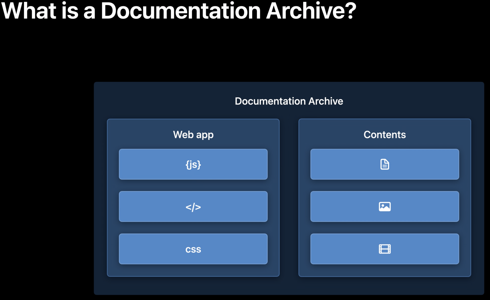

# Host and Automate Your DocC Documentation

David Rönnqvist, Software Engineer

- Hosting documentation
- Automating builds

## What is a Documentation Archive?

The documentation archive itself is a container that holds all the data to read
the documentation in Xcode and host it online.

It is hosted as a single-page view .js webapp that is used to render your
reference documentation and articles as well as your rich interactive tutorials.



There are two types of documentation requests:
- Requests for documentation and tutorial pages (Request URL starts with
  /documentation or /tutorials)
- Requests for additional files and data in the documentation archive. Request
  URL must match the relative file path for one of the files in the documentation
  archive.

Example:

If the request starts with:

https://hostname.com/documentation/slothcreator
https://hostname.com/tutorials/slothcreator

The server should respond with the index.html file located in the documentation
archive.

That file references CSS and JS within the documentation archive, which
the browser requests to load the rest of the webapp.

Once that is loaded, the webapp requests the content for that page, and any
images or other media that it references.

Both the files referenced by the index.html file and the content and media
loaded by the webapp use request URLs that match the folder structure of the
documentation archive.

## Hosting DocC Documentation

Example project using an Apache server for custom routing.

Directory example:

- Load the DocC archive into the root of the directory that serves the website
- Alongside an empty .htaccess file

Two routing rules to add:
- One for documentation and tutorial pages
- One for additional files and data

Example .htaccess file:

```
# Enable custom routing
RewriteEngine On

# Route documentation and tutorial pages.
RewriteRule ^(documentation|tutorials)\/.*$ SlothCreator.doccarchive/index.html [L]

# Route files within the documentation archive.
RewriteRule ^(css|js|data|images|downloads|favicon\.ico|favicon\.svg|img|theme-settings\.json|videos)\/.*$
    SlothCreator.doccarchive/$0 [L]

```

The main page groups important symbols into topics related to higher-level tasks.
Each of those group related symbols into more specific topics.

DocC comes with a built-in clean design that's made to fit in well with a variety
of projects.

## Automating DocC Documentation Builds

Write a script that calls `xcodebuild`. Run it whenever new changes are made so
the hosted documentation is always up-to-date.

New in Xcode 13, build documentation on the command line with the `xcodebuild
docbuild` action.

When you build documentation, it works like a standard build
but also builds documentation. During the build, the Swift compiler gathers
detailed information about all the public symbols, their relationships, and in-
source documentation comments, and passes this as a file called a symbolgraph to
the documentation compiler. This produces a documentation archive with all the
necessary data to both read the documentation in Xcode and host it online.

If the target has an associated documentation catalog with additional:
- Articles
- Media
- Tutorials

Then the documentation compiler combines that content with the symbol information
when it produces the documentation archive.

To learn more about documentation catalogs, check out this session:
- Elevate your DocC documentation in Xcode

To build documentation on the command line with `xcodebuild docbuild`, pass it
the scheme that you want to build, and the project or workspace it's a part of.

You can also pass additional flags, if needed, to customize how your project
is built.

```
# Build documentation for the project.
xcodebuild docbuild                     \
  -scheme SlothCreator                  \
  -sdk macosx                           \
  -destination generic/platform=macOS   \
  -configuration Debug
```

To make the build easy to follow, you can optionally specify a custom derived
data path where the build products and build documentation will be written:

```
# Build documentation for the project.
xcodebuild docbuild                     \
  -scheme SlothCreator                  \
  -derivedDataPath MyDerivedDataFolder
```

After build is complete, find the DocC archives and copy them to another location:

```
# Build documentation for the project.
xcodebuild docbuild                     \
  -scheme SlothCreator                  \
  -derivedDataPath MyDerivedDataFolder

# Find all the built documentation archives
# to copy them to another location.
find MyDerivedDataFolder                \
  -name "*.doccarchive"
```

## Bonus: Documentation for Dependencies

Building documentation doesn't just apply to your targets. If your target has
dependencies to other Swift frameworks, libraries, or packages, the same process
is applied to all of those, as well. This gives you all of the relevant documentation
for your project, all in one place.
