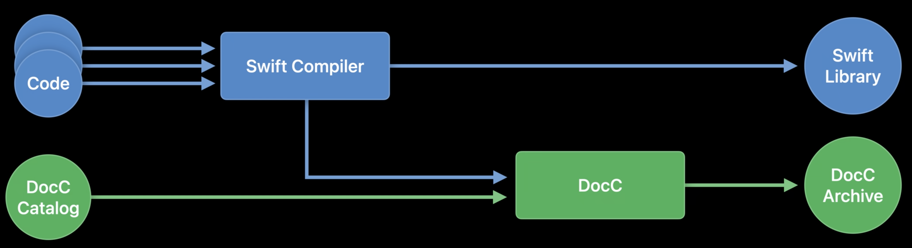
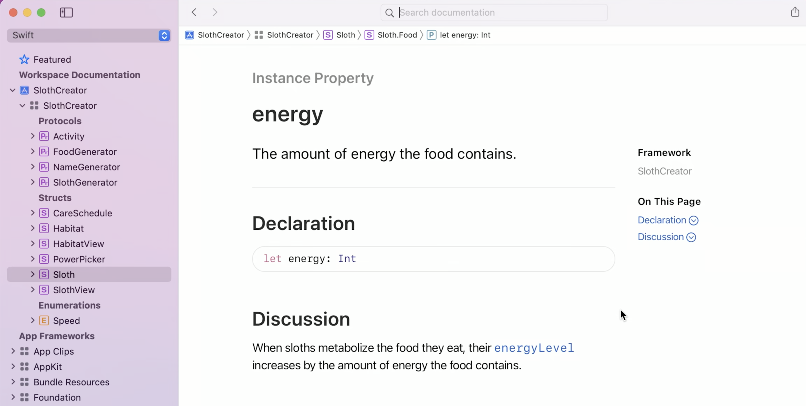

# Meet DocC Documentation in Xcode

Victoria Mitchell, Software Engineer
Ethan Kusters, Software Engineer

Xcode 13 has new features to build, write, and browse documentation.

## Overview

Xcode comes with a compiler for your documentation as well as your code. DocC.

Documentation Compiler (DocC). Fully integrated documentation environment that
complements Xcode.

Rich, live environment, with docs appearing in Quick Help. Rich code completion.
Full documentation available in the integrated Developer Documentation option.
Easy option to share pre-built documentation in Xcode and on the web.

Check out other DocC sessions at WWDC2021.
- Elevate your DocC documentation in Xcode
- Host and automate your DocC documentation
- Build interactive tutorials using DocC

*Reference documentation.* Gives users a birds-eye view of APIs in your framework
or package. How APIs work together and not just in isolation.

*Articles.* Allow you to walk users through the big picture behind your framework.

*Tutorials.* Powerful step-by-step walkthrough of writing a project that uses your
framework. Give users a guided introduction.

Releasing DocC as open source later this year, alongside a web app to host
documentation builds on the web. Host outside of Xcode.

## Building and Browsing

How documentation gets built:

When you compile your code, Xcode builds your framework or package and asks your
compiler to save information about its public APIs alongside your compiled
artifacts. That public API information is handed to DocC, which then combines
it with your documentation catalog.



This process repeats for every Swift framework and package that your target
depends on.

Three ways to build docs for Swift frameworks and packages in Xcode 13:
- To build documentation on-demand: Go to Product -> Build Documentation
- To preview documentation as you go: Build Settings -> Documentation
  Compiler - Options -> Build Documentation during 'Build' -> "Yes"
- For command lines and CI needs: `xcodebuild docbuild`

How does it work in action?

In a project that uses a package with DocC documentation, Go to Product -> Build
Documentation. This opens the new Developer Documentation window. Expand the
package in the sidebar - in the example, it's "Slothy" - and view the DocC docs.

Example with list of types and protocols. Click on it to load the page. Use the
Search field to find more info about stuff. Use breadcrumbs to view Types.
Get a picture of how all the APIs fit together.

## Authoring

DocC is designed around the benefits of in-source documentation. Write
documentation alongside code.

### Annotating comments to work with DocC

The first line of documentation turns into the summary. You can add more info by
adding a line break after the summary, and then continue the comment.

#### Forward-slash annotation

If you're already annotating code with comments, use the three forward slash
annotation. This tells the documentation compiler to associate the comment with
the declaration immediately below it.

`///` for documentation comments vs. `//` for code comments.

#### Block-style comment annotation

If you prefer block-style comments, use an extra `*` in the opening delimiter.

`/**` for documentation block comments vs. `/*` for code comments.

#### Code examples

Because DocC has full Markdown support, you can use Markdown fenced code block
syntax to add a code example.

#### Document methods

Document, specifically, what we're expecting to be passed as a parameter. Returns
work in basically the same way. Parameter can be a singular Parameter or plural
Parameters.

Example:

```
/// A model representing a sloth.
public struct Sloth {
  /// Sleep in the specified habitat.
  ///
  /// - Parameters:
  ///     - habitat: The location for the sloth to sleep.
  ///     - numberOfHours: The number of hours for the sloth to sleep.
  /// - Returns: The sloth's energy level after sleeping.
  mutating public func sleep(in habitat: Habitat, for numberOfHours: Int = 12) -> Int {
    energyLevel += habitat.comfortLevel * numberOfHours
    return energyLevel
  }
}
```

#### Link to other properties or methods within the documentation

Instead of just referring to a property as monospace text, i.e. `energyLevel`,
you can actually link to that property by using double backticks, i.e.
``energyLevel``. This creates a clickable link that takes the reader to the
relevant part of the documentation. This works for siblings of properties or
methods that you're currently documenting.

If the property is a child of another struct, you must further qualify the parent
type. For example, ``Habitat/comfortLevel`` to link to a child of the `Habitat`
struct.

Xcode code completion can help to make sure you're getting the correct link.

#### Use a template for documentation

You can get a template for documenting. Hold down CMD and click on the method's
declaration to open the Action menu. Click Add Documentation in the Action menu,
and this inserts a template to document the method.

After adding documentation, select the "Build Documentation" option from the
Product menu to see an updated version of the documentation.

### Viewing DocC documentation

Quick Help provides a similar, summarized view. Xcode 13 has a new "Open in
Developer Documentation" link to view the more detailed docs.

The new Developer Documentation window provides a complete view of all of the
documentation. Expand the package in the sidebar - in the example, it's "Slothy"
- and view the DocC docs for the package.



## Sharing

Documentation archives. Single-page webapp you can use to share documentation
on the web.

For more information about that, check out:
- Host and automate your DocC documentation

Xcode supports exporting and importing documentation directly from the
documentation window.

When you click "Export" in the Developer Documentation window, you can export to
a `.doccarchive` file in a location you specify. If you share this with a
colleague, they can double-click this `.doccarchive` file to open it in Xcode.
