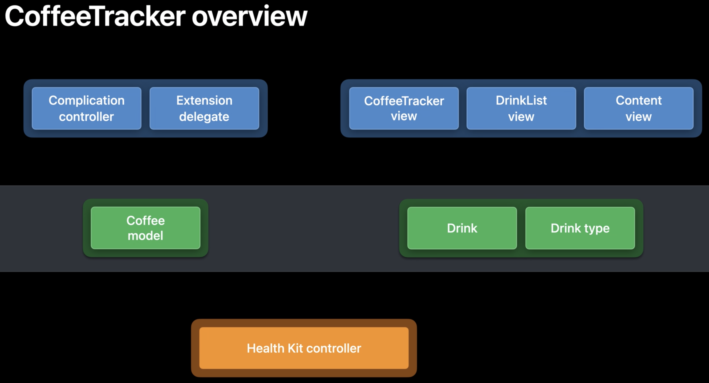

# Swift concurrency: Update a sample app

Presenters:
- Ben Cohen, Swift Team

Updating an app called Coffee Tracker. Includes lots of concurrency things to
think about, such as:

- How concurrency works with SwiftUI
- Delegate callbacks from the watch SDK
- SimIO
- Interfacing with async APIs in Apple's SDK

## App overview

App is roughly broken up into three layers:
1. The UI layer. Mostly SwiftUI views, but we can also consider watch complication
   data source as part of the UI layer.
2. The model layer. Comprises some simple value types to represent caffeine drinks,
   as well as a model type called Coffee model. This is the UI model; the place
   where you hold data for display by the UI layer. It's an observable object
   that feeds our SwiftUI view. All of the updates on it must be made on the main
   thread. Might not be the full model of all of the app's data; it might just
   be a projection of the data model, or a subset of it. Just what you need to
   display on the UI at this moment.
3. Backend layer. Processing that happens, probably in the background, to
   populate your model or talk to the world outside your app.



### How concurrency is currently managed in the app

The app is broken up into three concurrent queues:
- Main queue: work in the UI and on the model
- Background queue: for doing work in the background
- Arbitrary queues: certain callbacks into completion handlers, like those
  returning results from Health Kit, are done on arbitrary queues


This is fairly common. What seems like a simple app architecture ignores a lot of
the hidden complexity in how it handles concurrency.

With Swift concurrency, we'll transform this to something that looks like this:


For more info on new concurrency features, see:
- Meet async/await in Swift
- Protect mutable state with Swift actors

## Beginning to adopt async/await

Health Kit controller has a few different calls that take completion handlers.

Start with save:

Hit `ctrl + 6 to` see a list of functions in the file. Go to the `save` operation.

```
// Save a drink to HealthKit as a caffeine sample.
public func save(drink: Drink) {

    // Make sure HealthKit is available and authorized.
    guard isAvailable else { return }
    guard store.authorizationStatus(for: caffeineType) == .sharingAuthorized else { return }
}
...
```

### Explore thread safety

Is this code thread safe? It reads `isAvailable` and `store` variables, but that
isn't necessarily thread safe. If other code could be writing to them at the same
time, it isn't thread safe. To know whether or not it's thread safe, we need more
information than what we see in this function.

There's no use of dispatch queues or locks in it, so whatever makes this code
thread safe - if it is - must be elsewhere. Maybe the caller serializes all calls
to save through a queue, or maybe the app is constructed in some way that means
it's ok. But we can't know this just by looking at this function.

Being able to do that - look at the function and know certain things without
having to go look at other parts of the program - is local reasoning. It's a really
important goal for Swift. Swift's emphasis on value types is about local reasoning.
Unlike a reference type, you don't have to worry that a value type you've been
passed is being mutated elsewhere in your program. A lot of the concurrency
language features in Swift 5.5 are about giving you more opportunity to reason
locally about your code.

This function is thread safe, which we know from exploring the app.

### Converting a function to use new Swift concurrency features

Later in the function, there's a completion handler:

```
    ...
    // Save the sample to the HealthKit store.
    store.save(caffeineSample) { success, error in
        guard success else {
            self.logger.error("Unable to save \(caffeineSample) to the HealthKit store: \(error!.localizedDescription)")
            return
        }

        self.logger.debug("\(mgCaffeine) mg Drink saved to HealthKit")
    }
```

This would be much better as a method that would throw on failure. That doesn't
work with completion handlers. With async methods, we can throw. There's an async
equivalent to do this:

```
    ...
    // Save the sample to the HealthKit store.
    do {
        try await store.save(caffeineSample)
        self.logger.debug("\(mgCaffeine) mg Drink saved to HealthKit")
    } catch {
        self.logger.error("Unable to save \(caffeineSample) to the HealthKit store: \(error.localizedDescription)")
    }
```

After refactoring this, we get an error because we're calling async in a function
that is not asynchronous:

`'async' call in a function that does not support concurrency`

This is an issue because async can give up control of the thread, but the
function context does not provide for that.

One way to fix this is to make it an async function:

```
// Save a drink to HealthKit as a caffeine sample.
public func save(drink: Drink) async {
...
```

Now the file compiles. But the whole project doesn't compile yet. Making this
function async has pushed up the problem a level. Now we're getting the same
compile error in the `CoffeeData` file.

```
    ...
    // Save drink information to HealthKit
    healthKitController.save(drink: drink)
    ...
```

We _could_ keep going up the chain, but there's another technique to keep the
changes localized. Spin off a new async task:

```
    ...
    // Save drink information to HealthKit
    async { await self.healthKitController.save(drink: drink) }
    ...
```

This is very similar to calling async on the global dispatch queue. You can't
return a value from it back to the outer function because the block executes
concurrently. Whatever you do within the detached closure needs to be self-contained.

In this case, we're just calling `save` which doesn't return a value, so that's
fine.

You also need to be careful that you're not touching global state that might get
mutated simultaneously from other threads. This is where it was relevant that
save was completely thread safe; otherwise, we might be introducing new race
conditions by adding this async task.

### Completion handlers

This function takes a completion handler:

```
// Request authorization to read and save the required data types.
public func requestAuthorization(completionHandler: @escaping (Bool) -> Void) {
    guard isAvailable else { return }

    store.requestAuthorization(toShare: types, read: types) { success, error in

        // Check for any errors.
        guard error == nil else {
            self.logger.error("An error occurred while requesting HealthKit Authorization: \(error!.localizedDescription)")
            return
        }

        // Set the authorization property, and call the handler.
        self.isAuthorized = success
        completionHandler(success)
    }
}
```

For this function, we'll create a second version of this function to become async
while still keeping the completion handler version. This way, other parts of the
code that call it with a completion handler can keep working. We can do this with
the `Create async alternative refactoring` action.

Bring up the code action menu with cmd + shift + a and choose the option to `Add
Async Alternative`. This adds a second version of the function from the original
code:

```
public func requestAuthorization(completionHandler: @escaping (Bool) -> Void) {
    async {
        let result = await requestAuthorization()
        completionHandler(result)
    }

public func requestAuthorization() async -> Bool {
    guard isAvailable else { return }

    do {
        let success = try await store.requestAuthorization(toShare: types, read: types)
        self.isAuthorized = success
        return success
    } catch let error {
        self.logger.error("An error occurred while requesting HealthKit Authorization: \(error.localizedDescription)")
    }
}
```

It also adds a deprecation warning to the original completion handler version:
`@available(*, deprecated, message: "Prefer async alternative instead")`

This helps guide to parts of the code that could be refactored to use the async
version.

However, this version of the function still isn't necessarily thread safe. Just
because we've converted to async doesn't mean we're necessarily free from race
conditions. You can actually introduce new race conditions into your code by
refactoring to use async.

One issue is the `isAvailable` return. Instead, replace it with a `return false`.
We need to return `true` on the happy path, instead of `success`, and `false` if
it fails with an error.

```
public func requestAuthorization() async -> Bool {
    guard isAvailable else { return false }

    do {
        let success = try await store.requestAuthorization(toShare: types, read: types)
        self.isAuthorized = true
        return true
    } catch let error {
        self.logger.error("An error occurred while requesting HealthKit Authorization: \(error.localizedDescription)")
        return false
    }
}
```

Now the project compiles. We can use the new async function, and existing calls
with a completion handler will be forwarded to the new async function without
breaking the app where they're currently called. The deprecation warning will
help find those spots and fix them in the future.

## Using continuations

Start with a stub for the old code to call:

```
@available(*, deprecated, message: "Prefer async alternative instead")
public func loadNewDataFromHealthKit(completionHandler: @escaping (Bool) -> Void = { _ in }) {
    async { completionHandler(await self.loadNewDataFromHealthKit())}
}
```

This one takes an optional completion handler.

```
// Reads data from the HealthKit store.
public func loadNewDataFromHealthKit(completionHandler: @escaping (Bool) -> Void = { _ in }) {

    guard isAvailable else {
        logger.debug("HealthKit is not available on this device.")
        completionHandler(false)
        return
    }

    logger.debug("Loading data from HealthKit")
    ...
}
```

With an async function, that would be analogous to a discardable result:

```
// Reads data from the HealthKit store.
@discardableResult
public func loadNewDataFromHealthKit(completionHandler: @escaping (Bool) -> Void = { _ in }) {
```

Then start going througn and replacing the completion handler code:

```
// Reads data from the HealthKit store.
@discardableResult
public func loadNewDataFromHealthKit() async -> Bool {

    guard isAvailable else {
        logger.debug("HealthKit is not available on this device.")
        return false
    }
```

Then we run into a snag. The completion handler for the query API is on the query
type, but what we want to await is the execution of the query later in the function:

```
    ...
    // Create a predicate that only returns samples created within the last 24 hours.
    let endDate = Date()
    let startDate = endDate.addingTimeInterval(-24.0 * 60.0 * 60.0)
    let datePredicate = HKQuery.predicateForSamples(withStart: startDate, end: endDate, options: [.strictStartDate, .strictEndDate])

    // Create the query
    let query = HKAnchoredObjectQuery(
        type: caffeineType,
        predicate: datePredicate,
        anchor: anchor,
        limit: HKObjectQueryNoLimit) { (_, samples, deletedSamples, newAnchor, error) in

        // When the query ends, check for errors.
        ...
    }

    store.execute(query)
}
```

What we want to do is create a single async function that both creates the query,
and then executes it. We'll do that using a technique called a continuation.

We'll start by creating a helper function:

```
private func queryHealthKit() async throws -> ([HKSample]?, [HKDeleteObject]?, HKQueryAnchor?) {

}
```

Then, take the querying code, and move it into the helper function, then add the
query execution:

```
private func queryHealthKit() async throws -> ([HKSample]?, [HKDeleteObject]?, HKQueryAnchor?) {
    // Create a predicate that only returns samples created within the last 24 hours.
    let endDate = Date()
    let startDate = endDate.addingTimeInterval(-24.0 * 60.0 * 60.0)
    let datePredicate = HKQuery.predicateForSamples(withStart: startDate, end: endDate, options: [.strictStartDate, .strictEndDate])

    // Create the query
    let query = HKAnchoredObjectQuery(
        type: caffeineType,
        predicate: datePredicate,
        anchor: anchor,
        limit: HKObjectQueryNoLimit) { (_, samples, deletedSamples, newAnchor, error) in

        // When the query ends, check for errors.
        if let error = error {
            self.logger.error("An error occurred while querying for samples: \(error.localizedDescription)")
            completionHandler(false)
            return
        }
    }  
    store.execute(query)
}
```

We need to somehow invert the code so it can await the completion handler and
return the values out of the async function. That's where we use a continuation:

```
private func queryHealthKit() async throws -> ([HKSample]?, [HKDeleteObject]?, HKQueryAnchor?) {
    return try await withCheckedThrowingContinuation {continuation in
        // Create a predicate that only returns samples created within the last 24 hours.
        let endDate = Date()
        let startDate = endDate.addingTimeInterval(-24.0 * 60.0 * 60.0)
        let datePredicate = HKQuery.predicateForSamples(withStart: startDate, end: endDate, options: [.strictStartDate, .strictEndDate])

        // Create the query
        let query = HKAnchoredObjectQuery(
            type: caffeineType,
            predicate: datePredicate,
            anchor: anchor,
            limit: HKObjectQueryNoLimit) { (_, samples, deletedSamples, newAnchor, error) in

            // When the query ends, check for errors.
            if let error = error {
                self.logger.error("An error occurred while querying for samples: \(error.localizedDescription)")
                completionHandler(false)
                return
            }
        }  
        store.execute(query)
    }
}
```

Then, use the continuation to replace the completion handlers by throwing the
error in the case of failure, or resuming returning the useful values:

```
private func queryHealthKit() async throws -> ([HKSample]?, [HKDeleteObject]?, HKQueryAnchor?) {
    return try await withCheckedThrowingContinuation {continuation in
        // Create a predicate that only returns samples created within the last 24 hours.
        let endDate = Date()
        let startDate = endDate.addingTimeInterval(-24.0 * 60.0 * 60.0)
        let datePredicate = HKQuery.predicateForSamples(withStart: startDate, end: endDate, options: [.strictStartDate, .strictEndDate])

        // Create the query
        let query = HKAnchoredObjectQuery(
            type: caffeineType,
            predicate: datePredicate,
            anchor: anchor,
            limit: HKObjectQueryNoLimit) { (_, samples, deletedSamples, newAnchor, error) in

            // When the query ends, check for errors.
            if let error = error {
                self.logger.error("An error occurred while querying for samples: \(error.localizedDescription)")
                continuation.resume(throwing: error)
            } else {
                continuation.resume(returning: (samples, deletedSamples, newAnchor))
            }
        }  
        store.execute(query)
    }
}
```

Now that we have this awaitable function, we can use it in our original code.
We assign the results of awaiting our new query:

```
let (samples, deletedSamples, newAnchor) = try await queryHealthKit()
```
And we want to handle the errors, so put it inside a do-catch block:

```
do {
    let (samples, deletedSamples, newAnchor) = try await queryHealthKit()
} catch {

}
```

Pull the error logging code out of the helper function block:

```
do {
    let (samples, deletedSamples, newAnchor) = try await queryHealthKit()
} catch {
    self.logger.error("An error occurred while querying for samples: \(error.localizedDescription)")
    return false
}
```

Then take the remainder of the code and move it up into the happy path:

```
do {
    let (samples, deletedSamples, newAnchor) = try await queryHealthKit()
    // Update the anchor.
    self.anchor = newAnchor

    // Convert new caffeine samples into Drink instances
    var newDrinks: [Drink] = []
    if let samples = samples {
        newDrinks = self.drinksToAdd(from: samples)
    }

    // Create a set of UUIDs for any samples deleted from HealthKit.
    let deletedDrinks = self.drinksToDelete(from: deletedSamples ?? [])

    // Update the data on the main queue.
    DispatchQueue.main.async {
        // Update the model
        self.updateModel(newDrinks: newDrinks, deletedDrinks: deletedDrinks)
        completionHandler(true)
    }
} catch {
    self.logger.error("An error occurred while querying for samples: \(error.localizedDescription)")
    return false
}
```

And finally, address the closure that's still using the completion handler. This
`DispatchQueue.main.async` call with the completion handler no longer works to
return our information to our caller. This is a good case to use actors. Replace
the `DispatchQueue.main.async` with a call to MainActor's `run` function:

```
    // Update the data on the main queue.
    MainActor.run {
        // Update the model
        self.updateModel(newDrinks: newDrinks, deletedDrinks: deletedDrinks)
        completionHandler(true)
    }
```

This takes a block of code to run on the MainActor. Run is an async function, so
we need to await it.

```
    // Update the data on the main queue.
    await MainActor.run {
        // Update the model
        self.updateModel(newDrinks: newDrinks, deletedDrinks: deletedDrinks)
        completionHandler(true)
    }
```

Because we await it, we can remove our completion handler use, and once this block
completes, we just return true:

```
    // Update the data on the main queue.
    await MainActor.run {
        // Update the model
        self.updateModel(newDrinks: newDrinks, deletedDrinks: deletedDrinks)
    }
    return true
    ...
```

Now the compiler returns an error - a new error about a captured variable:
`Reference to captured var newDrinks in concurrently-executing code`

This error only occurs inside async functions. Because closures in Swift capture
variables by reference, when you capture mutable variables - in this case, our
`newDrinks` array - you create the possibility for shared, mutable state. That
can be the cause of race conditions. In doing this, you need to make sure you're
using an immutable copy. One way to do this is to add `[newDrinks]` to the
closure's capture list, and this will automatically make an immutable copy that
can be used within in the closure:

```
    // Update the data on the main queue.
    await MainActor.run { [newDrinks] in
        // Update the model
        self.updateModel(newDrinks: newDrinks, deletedDrinks: deletedDrinks)
    }
    return true
    ...
```

It's better to avoid the problem by not having mutable variables in the first
place. Here, we can do this by changing our newDrinks. It's written this way
because of the optionality of the completion handler. If we instead turn it into
a let, and in the `else` path, just assign an empty value, the issue is resolved:

```
    // Convert new caffeine samples into Drink instances
    let newDrinks: [Drink]
    if let samples = samples {
        newDrinks = self.drinksToAdd(from: samples)
    } else {
        newDrinks = []
    }
```

## Using the main actor

Let's look at a function that has to run on the main thread. At the top is a
great idea; an assert to make sure it's running on the main thread:

```
// Update the model.
private func updateModel(newDrinks: [Drink], deletedDrinks: Set<UUID>) {
    assert(Thread.main == Thread.current, "Must be run on the main queue because it accesses currentDrinks.")
}
```

If you ever made a mistake and called this function without wrapping it in a
Dispatch.async to the main thread, you'd get an error in your debug builds.

However, it's better if the compiler can enforce some of these rules for you so
you can't make these kinds of errors.

Annotate a function as main actor to ensure the caller switches to the main thread:

```
// Update the model.
@MainActor
private func updateModel(newDrinks: [Drink], deletedDrinks: Set<UUID>) {

}
```

We can remove the assertion, because the compiler won't let this function be run
anywhere but on the main thread.

This feature is similar to optional values. It's easy to forget to check for nil.
It's much better to let the compiler make sure this check always happens. Here,
we're doing a similar thing, although instead of enforcing nil checks, it's
enforcing that you run on the main actor.

But how can we ensure other methods are free of race conditions? We could just
make the entire HealthKitController run on the main actor. Putting the annotation
on the class ensures that all of the class's methods run on the main thread:

```
@MainActor
class HealthKitController {
    ...
}
```

For a simple application, that might be an ok choice. But the controller is really
about the backend of the app, and we want to leave the main thread free to do UI
activities. So instead, we can change the class, itself, to be an actor:

```
actor HealthKitController {
    ...
}
```

Unlike the main actor, which is a global actor, this actor type can be instantiated
multiple times.

## Dealing with errors

Resist the temptation to mash the "Fix" button when dealing with compiler errors
as you convert to Swift's new concurrency features. Instead, use these techniques:

- Try to keep the change isolated and done one step at a time, with your project
  compiling and working in between each change.
- Add shims to allow your old code to keep working, even though you might end
  up deleting them later. That way, you can gradually move out from a point,
  tidying up the code as you go.

In this example, we first convert the HealthKit controller to use async, and then
make it an actor. It generally works out better to do it in that order, rather than
the other way around.

## Factoring out actors

Follow the deprecation warning breadcrumbs into the next place you want to work
on refactoring.

The first place is the model:

```
// The data model for the Coffee Tracker app.
class CoffeeData: ObservableObject {

    let logger = Logger(subsystem: "com.example.apple-samplecode.Coffee-Tracker.watchkitapp.watchkitextension.CoffeeData", category: "Model")

    // The data model needs to be accesses both from the app extension
    // and from the complication controller.
    static let shared = CoffeeData()
    lazy var healthKitController = HealthKitController(withModel: self)

    // A background queue used to save and load the model data
    private var background = DispatchQueue(label: "Background Queue", qos: .userInitiated)

    // The list of drinks consumed.
    // Because this is @Published property,
    // Combine notifies any observers when a change occurs.
    @Published public var currentDrinks: [Drink] = [] {
        didSet {
            logger.debug("A value has been assigned to the current drinks property.")

            // Update any complications on active watch faces.
            let server = CLKComplicationServer.sharedInstance()
            for complication in server.activeComplications ?? [] {
                server.reloadTimeline(for: complication)
            }

            // Begin saving the data
            self.save()
        }
    }
}
```

This class implements ObservableObject and has an @Published property. Any
updates to properties that are @Published to a SwiftUI view must be done on the
main thread. So this class is probably a good candidate to put on the main actor.

But there's also a background dispatch queue for doing some work in the background.
Let's look at where it's used. It's just in two functions: `load()` and `save()`.
That makes sense - you probably don't want to do your loading and saving on the
main thread.

When you see a pattern like this, where a queue is used to coordinate some specific
activities but the rest of the class needs to be on the main thread, that's a sign
that you want to factor that background code out into a separate actor. Let's do
that now.

Let's go to the top of the file and create a new private actor called `CoffeeDataStore`:

```
private actor CoffeeDataStore {

}

// The data model for the Coffee Tracker app.
...
```

Then, open the file again in a side-by-side window, and start moving code over.
Let's give it its own logger:

```
private actor CoffeeDataStore {
    let logger = Logger(subsystem:
        "com.example.apple-samplecode.Coffee-Tracker.watchkitapp
        .watchkitextension.CoffeeDataStore", category: "Model")
}

// The data model for the Coffee Tracker app.
...
```

Next, instead of this background dispatch queue, we'll use an instance of our
new actor:

```
    ...
    // A background queue used to save and load the model data
    private var background = DispatchQueue(label: "Background Queue", qos: .userInitiated)
    private let store = CoffeeDataStore()
    ...
```

First, let's go to the save operation and take this and move it into the actor:

```
private actor CoffeeDataStore {
    let logger = Logger(subsystem:
        "com.example.apple-samplecode.Coffee-Tracker.watchkitapp
        .watchkitextension.CoffeeDataStore", category: "Model")

    // Begin saving the drink data to disk.
    func save() {

        // Don't save the data if there haven't been any changes.
        if currentDrinks == savedValue {
            logger.debug("The drink list hasn't changed. No need to save.")
            return
        }

        // Save as a binary plist file.
        let encoder = PropertyListEncoder()
        encoder.outputFormat = .binary

        let data: Data

        do {
            // Encode the currentDrinks array.
            data = try encoder.encode(currentDrinks)
        } catch {
            logger.error("An error occurred while encoding the data:
                \(error.localizedDescription)")
            return
        }

        // Save the data to disk as a binary plist file.
        let saveAction = {
            do {
                // Write the data to disk
                try data.write(to: self.dataURL, options: [.atomic])

                // Update the saved value.
                self.savedValue = self.currentDrinks

                self.logger.debug("Saved!")
            } catch {
                self.logger.error("An error occurred while saving the data:
                    \(error.localizedDescription)")
            }
        }

        // If the app is running in the background, save synchronously.
        if WKExtension.shared().applicationState == .background {
            logger.debug("Synchronously saving the model on \(Thread.current).")
            saveAction()
        } else {
            // Otherwise save the data on a background queue.
            background.async {
                self.logger.debug("Asynchronously saving the model on a
                    background thread.")
                saveAction()
            }
        }
    }
}

// The data model for the Coffee Tracker app.
...
```

And compile and see what issues we get. First, current drinks:

`Cannot find 'currentDrinks in scope'`:

```
        ...
        // Don't save the data if there haven't been any changes.
        if currentDrinks == savedValue {
        ...
```

This was a property of the model type before we moved this method out into the
actor. How can we access it now?

The way the actors relay information is to pass values between each other. We
should have this function take `currentDrinks` as an argument:

```
    // Begin saving the drink data to disk.
    func save(_ currentDrinks: [Drink]) {

        // Don't save the data if there haven't been any changes.
        if currentDrinks == savedValue {
```

Next, `savedValue`:

`Cannot find 'savedValue' in scope`:

```
// Don't save the data if there haven't been any changes.
if currentDrinks == savedValue {
```

This is a copy of the values that were last saved, to avoid saving unnecessarily
when nothing is changed. This value is mutated by both the `save()` function and
the `load()` function, so it definitely needs protecting by the actor. Let's just
move it over into the actor:

```
private actor CoffeeDataStore {
    let logger = Logger(subsystem:
        "com.example.apple-samplecode.Coffee-Tracker.watchkitapp
        .watchkitextension.CoffeeDataStore", category: "Model")

    // Use this value to determine whether you have changes that can be saved to
        disk.
    private var savedValue: [Drink] = []

    // Begin saving the drink data to disk.
    func save(_ currentDrinks: [Drink]) {
```

Ok, next, this property `dataURL` is just used by the load and save operations,
so we can move it over into the actor:

```
        ...
        // If the app is running in the background, save synchronously.
        if WKExtension.shared().applicationState == .background {
            logger.debug("Synchronously saving the model on \(Thread.current).")
            saveAction()
        } else {
            // Otherwise save the data on a background queue.
            background.async {
                self.logger.debug("Asynchronously saving the model on a
                    background thread.")
                saveAction()
            }
        }
    }

    // Returns the URL for the plist file that stores the drink data.
    private var dataURL: URL {
        get throws {
            try FileManager
                    .default
                    .url(for: .documentDirectory,
                         in: .userDomainMask,
                         appropriateFor: nil,
                         create: false)
                    // Append the file name to the directory.
                    .appendingPathComponent("CoffeeTracker.plist")
        }
    }
}
```

Now, we're getting some errors related to a closure that's capturing some state
from the actor:

```
        ...
        // Save the data to disk as a binary plist file.
        let saveAction = {
            do {
                // Write the data to disk
                try data.write(to: self.dataURL, options: [.atomic])

                // Update the saved value.
                self.savedValue = self.currentDrinks

                self.logger.debug("Saved!")
            } catch {
                self.logger.error("An error occurred while saving the data:
                    \(error.localizedDescription)")
            }
        }
        ...
```

Why is there a closure here? If we look down, it's because the same piece of
code is used in two places:

```
        ...
        // If the app is running in the background, save synchronously.
        if WKExtension.shared().applicationState == .background {
            logger.debug("Synchronously saving the model on \(Thread.current).")
            saveAction()
        } else {
            // Otherwise save the data on a background queue.
            background.async {
                self.logger.debug("Asynchronously saving the model on a
                    background thread.")
                saveAction()
            }
        }
        ...
```

And this actually turns out to be an issue that the compiler has flagged that is
pretty interesting. This code is checking to see if the watch extension is
currently running in the background. If it is running in the background already,
don't go in the background queue; just stay on the main thread and perform the
task synchronously. But this doesn't seem right; you should never block the main
thread to perform a synchronous IO operation. Even when your app is running in
the background. Why does the app do this?

We can trace it back to where the save operation is being called:

```
        // The list of drinks consumed.
        // Because this is @Published property,
        // Combine notifies any observers when a change occurs.
        @Published public var currentDrinks: [Drink] = [] {
            didSet {
                logger.debug("A value has been assigned to the current drinks property.")

                // Update any complications on active watch faces.
                let server = CLKComplicationServer.sharedInstance()
                for complication in server.activeComplications ?? [] {
                    server.reloadTimeline(for: complication)
                }

                // Begin saving the data
                self.save()
            }
        }
```

It's being called from a `didSet`. That fires so whenever the property is assigned,
it saves the new values. `didSet`s are super convenient, but they can be a little
too tempting. Let's look at all of the callers of the `currentDrinks` property.

If we drill all the way down, we can find that the save operation is synchronous
because the way it is going to be called originates in the watch kit extension's
handler for background tasks:

```
    func handle(_ backgroundTasks: Set<WKRefreshBackgroundTask>) {
        logger.debug("Handling a background task...")
        logger.debug("App State: \(WKExtension.shared().applicationState.rawValue)")

        for task in backgroundTasks {
            logger.debug("Task: \(task)")

            switch task {
                // Handle background refresh tasks.
                case let backgroundTask as WKApplicationRefreshBackgroundTask:

                    // Check for updates from HealthKit.
                    let model = CoffeeData.shared

                    model.healthKitController.loadNewDataFromHealthKit { success in

                        if success {
                            // Schedule the next background update.
                            scheduleBackgroundRefreshTasks()
                            self.logger.debug("Background Task Completed Successfully!")
                        }

                        // Mark the task as ended, and request an updated snapshot, if necessary.
                        backgroundTask.setTaskCompletedWithSnapshot(success)
                    }
                case let snapshotTask as WKSnapshotRefreshBackgroundTask:
                    snapshotTask.setTaskCompleted(restoredDefaultState: true, estimatedSnapshotExpiration: Date.distantFuture, userInfo:
                        nil)
                ...
```

This handle API has a contract. You're supposed to do all of your work, and then
call this `setTaskCompletedWithSnapshot` method. You must guarantee all your work
is done when you call this. Your watch app will be suspended at that point.

You can't have some IO operation, like our `save()` operation, still running when
you say that you're done.

Let's take a look at the global reasoning around this code:


It's the synchronous parts that force us to perform synchronous IO on the main
thread. How can we fix this?

To fix this with completion handlers, you'd have to update each currently
synchronous method to now take a completion handler. But you can't do that with
`didSet` - it doesn't take arguments, it just fires automatically when you update
the property.

So first, let's go to the `@Published` property, and we'll make it a `private(set)`:

```
        // The list of drinks consumed.
        // Because this is @Published property,
        // Combine notifies any observers when a change occurs.
        @Published public private(set) var currentDrinks: [Drink] = [] {
            didSet {
                logger.debug("A value has been assigned to the current drinks property.")
```

Then, let's take the `didSet` operation, and move this logic into a new
`drinksUpdated` function:

```
// The list of drinks consumed.
// Because this is @Published property,
// Combine notifies any observers when a change occurs.
@Published public var currentDrinks: [Drink] = []

private func drinksUpdated() async {
    logger.debug("A value has been assigned to the current drinks property.")

    // Update any complications on active watch faces.
    let server = CLKComplicationServer.sharedInstance()
    for complication in server.activeComplications ?? [] {
        server.reloadTimeline(for: complication)
    }

    // Begin saving the data
    self.save()
}

```

We'll make the function async, and in it, we need to await a call to our new
actor save operation, into which we pass the new `currentDrinks` values:

```
@Published public var currentDrinks: [Drink] = []

private func drinksUpdated() async {
    logger.debug("A value has been assigned to the current drinks property.")

    // Update any complications on active watch faces.
    let server = CLKComplicationServer.sharedInstance()
    for complication in server.activeComplications ?? [] {
        server.reloadTimeline(for: complication)
    }

    // Begin saving the data
    await store.save(currentDrinks)
}
```

Then, we need to go to wherever `currentDrinks` is updated, and make sure we call
`drinksUpdated` afterward. Make the calling function async, and await `drinksUpdated()`:

```
@MainActor
public func updateModel(newDrinks: [Drink], deletedDrinks: Set<UUID>) async {

    guard !newDrinks.isEmpty&& !deletedDrinks.isEmpty else {
        logger.debug("No drinks to add or delete from HealthKit.")
        return
    }

    // Remove the deleted drinks.
    var drinks = currentDrinks.filter { deletedDrinks.contains($0.uuid) }

    // Add the new drinks.
    drinks += newDrinks

    // Sort the array by date.
    drinks.sort { $0.date < $1.date }

    currentDrinks = drinks

    await drinksUpdated()
}
```

There's one final thing to note here. It's important to note that the operation
that makes a copy of currentDrinks, mutates it, and then writes it back, happens
as one atomic operation.

This is why the `await` keyword is so vital a clue. It indicates that at this
point in the code, this operation may suspend, and other operations - operations
that may also update currentDrinks - could run. So we need to make sure our update
of fetching the value, mutating it, and storing it back, is complete before calling
any awaitable operations.

So that's it. We can now go back to our `save` operation and complete the refactor
by changing this actor to do all of the operations in the background:

```
    do {
        // Encode the currentDrinks array.
        data = try encoder.encode(currentDrinks)
    } catch {
        logger.error("An error occurred while encoding the data:
            \(error.localizedDescription)")
        return
    }


    do {
        // Write the data to disk
        try data.write(to: self.dataURL, options: [.atomic])

        // Update the saved value.
        self.savedValue = currentDrinks

        self.logger.debug("Saved!")
    } catch {
        self.logger.error("An error occurred while saving the data:
            \(error.localizedDescription)")
    }
```

Finally, let's look at the load operation. The logic is split between the code
that needs to run in the background and the code that needs to run back on the
main thread:

```
// Begin loading the data from disk.
func load() {
    // Read the data from a background queue.
    background.async { [self] in
        logger.debug("Loading the model.")

        var drinks: [Drink]

        do {
            // Load the drink data from a binary plist file.
            let data = try Data(contentsOf: self.dataURL)

            // Decode the data.
            let decoder = PropertyListDecoder()
            drinks = try decoder.decode([Drink].self, from: data)
            logger.debug("Data loaded from disk")
        } catch CocoaError.fileReadNoSuchFile {
            logger.debug("No file found--creating an empty drink list.")
            drinks = []
        } catch {
            fatalError("*** An unexpected error occurred while loading the
                drink list: \(error.localizedDescription) ***")
        }

        // Update the entries on the main queue.
        DispatchQueue.main.async {
            // Update the saved value.
            savedValue = drinks

            // Drop old drinks
            ...
```

We'll lift just the top part of the function and move it into the actor:


```
...
} catch {
    self.logger.error("An error occurred while saving the data:
        \(error.localizedDescription)")
}

// Begin loading the data from disk.
func load() {
    // Read the data from a background queue.
    background.async { [self] in
        logger.debug("Loading the model.")

        var drinks: [Drink]

        do {
            // Load the drink data from a binary plist file.
            let data = try Data(contentsOf: self.dataURL)

            // Decode the data.
            let decoder = PropertyListDecoder()
            drinks = try decoder.decode([Drink].self, from: data)
            logger.debug("Data loaded from disk")
        } catch CocoaError.fileReadNoSuchFile {
            logger.debug("No file found--creating an empty drink list.")
            drinks = []
        } catch {
            fatalError("*** An unexpected error occurred while loading the
                drink list: \(error.localizedDescription) ***")
        }

        // Update the entries on the main queue.
        DispatchQueue.main.async {
            // Update the saved value.
            savedValue = drinks
```

In doing this, we notice another possible race condition. `saveValue` was updated
on the main queue, but if you remember the save operation, it was read and written
on the background queue. Now, as it happens, the way the app was constructed,
the load only ever happened on startup, so this was fine. But this relied on
global reasoning, and it's the kind of assumption that can break in subtle
ways when you make future changes. It's much better to let the actor make sure
that the queue will always be correct.

Remove the queue management and fix up the indentation:

```
// Begin loading the data from disk.
func load() {
    logger.debug("Loading the model.")

    var drinks: [Drink]

    do {
        // Load the drink data from a binary plist file.
        let data = try Data(contentsOf: self.dataURL)

        // Decode the data.
        let decoder = PropertyListDecoder()
        drinks = try decoder.decode([Drink].self, from: data)
        logger.debug("Data loaded from disk")
    } catch CocoaError.fileReadNoSuchFile {
        logger.debug("No file found--creating an empty drink list.")
        drinks = []
    } catch {
        fatalError("*** An unexpected error occurred while loading the
            drink list: \(error.localizedDescription) ***")
    }

    // Update the saved value.
    savedValue = drinks
```

And just like save, we need a way to pass back the loaded values, which we can
do by returning a value from the load function:

```
// Begin loading the data from disk.
func load() -> [Drink] {
    logger.debug("Loading the model.")

    var drinks: [Drink]

    do {
        // Load the drink data from a binary plist file.
        let data = try Data(contentsOf: self.dataURL)

        // Decode the data.
        let decoder = PropertyListDecoder()
        drinks = try decoder.decode([Drink].self, from: data)
        logger.debug("Data loaded from disk")
    } catch CocoaError.fileReadNoSuchFile {
        logger.debug("No file found--creating an empty drink list.")
        drinks = []
    } catch {
        fatalError("*** An unexpected error occurred while loading the
            drink list: \(error.localizedDescription) ***")
    }

    // Update the saved value.
    savedValue = drinks
    return drinks
}
```

Now, back in the `load()` operation on the model, we can delete the code we moved.
What we need to do now is load our data from the IO actor:

```
// Begin loading the data from disk.
func load() {
    var drinks = await store.load()
    // Drop old drinks
    drinks.removeOutdatedDrinks()    

    // Assign loaded drinks to model
    currentDrinks = drinks

    // Load new data from HealthKit.
    self.healthKitController.requestAuthorization { (success) in
        guard success else {
            logger.debug("Unable to authorize HealthKit")
            return
        }

        self.healthKitController.loadNewDataFromHealthKit()
    }
```

Now we can start cleaning up the deprecated methods, and we need to make the
`load()` asynchronous:

```
// Begin loading the data from disk.
func load() async {
    var drinks = await store.load()
    // Drop old drinks
    drinks.removeOutdatedDrinks()    

    // Assign loaded drinks to model
    currentDrinks = drinks

    // Load new data from HealthKit.
    let success = await self.healthKitController.requestAuthorization()
        guard success else {
            logger.debug("Unable to authorize HealthKit")
            return
        }

        await self.healthKitController.loadNewDataFromHealthKit()
    }
```

But a bit higher in the model, we have another instance of `load()`:

```
// The model's initializer. Do not call this method.
// Use the shared instance instead.
private init() {
    // Begin loading the data from disk.
    load()
}
```

We need this load to be called from a new async task:

```
// The model's initializer. Do not call this method.
// Use the shared instance instead.
private init() {
    // Begin loading the data from disk.
    async task { load() }
}
```

But at this point, if we just used an async task, we're potentially introducing
a new race condition. Outside of an actor, creating a new async task runs on an
arbitrary thread. We shouldn't mutate shared state like current drinks from an
arbitrary thread.

One way to resolve this is to put this task on the main actor:

```
// Begin loading the data from disk.
@MainActor
func load() async {
    var drinks = await store.load()
    // Drop old drinks
    ...
```

But there's a better way of doing this, which involves moving the whole model
type onto the main actor.

The way we do this is to go to our model definition and add `@MainActor`
to our model type.

```
// The data model for the Coffee Tracker app.
@MainActor
class CoffeeData: Observable Object {
    let logger = Logger(subsystem:
        "com.example.apple-samplecode.Coffee-Tracker.watchkitapp
        .watchkitextension.CoffeeData", category: "Model")
    ...
```

By putting the model on the main actor, we're now guaranteeing that all access to
`CoffeeData`'s properties are going to be made from the main thread. This is good,
because, as we noted earlier, it's an `ObservableObject`, with a `@Published` property,
and properties `@Published` to SwiftUI must only be updated on the main thread. It
also means any calls to async from the actor will also run on the actor.

You may have noticed that protecting this type with `@MainActor` didn't lead to
any compilation errors, unlike earlier, when we moved our healthKitController
into an actor. That's because the places we're calling into our model are things
like SwiftUI views.

The view is itself on the main actor, so its methods can call into my model type
on the main actor without needing any awaits. What determines that the SwiftUI
view is on the main actor? Well, it's inferred from the use of `@EnvironmentObject`
here:

```
import SwiftUI

// Display a list of drinks.
// Users can select drinks from the list.
struct DrinkListView: View {
    @EnvironmentObject var coffeeData: CoffeeData
    @Environment(\.presentationMode) var presentationMode

    // Layout the view's body.
    ...
}
```

Any SwiftUI view that accesses shared state, such as EnvironmentObjects or
ObservedObject, will always be on the main actor.

Elsewhere, we're also accessing our model from an `ExtensionDelegate` call that
we saw earlier. Since this extension delegate is guaranteed to always be called
on the main thread, it's been annotated by WatchKit as running on the main actor,
so it can call into our model type directly.

Finally, while we're here, let's refactor our method to get rid of this deprecated
completion handler usage.

```
    ...
    case let backgroundTask as WKApplicationRefreshBackgroundTask:

        // Check for updates from HealthKit.
        let model = CoffeeData.shared

        model.healthKitController.loadNewDataFromHealthKit { success in

            if success {
                // Schedule the next background update.
                scheduleBackgroundRefreshTasks()
                self.logger.debug("Background Task Completed Successfully!")
            }

            // Mark the task as ended, and request an updated snapshot, if necessary.
            backgroundTask.setTaskCompletedWithSnapshot(success)
        }
    ...
```

We can instead wrap this in another async task.

```
    ...
    case let backgroundTask as WKApplicationRefreshBackgroundTask:

        async {
        // Check for updates from HealthKit.
        let model = CoffeeData.shared

        await model.healthKitController.loadNewDataFromHealthKit { success in

            if success {
                // Schedule the next background update.
                scheduleBackgroundRefreshTasks()
                self.logger.debug("Background Task Completed Successfully!")
            }

            // Mark the task as ended, and request an updated snapshot, if necessary.
            backgroundTask.setTaskCompletedWithSnapshot(success)
        }
    ...
```

And then, once the HealthKit `load()` returns, we know all of our work is completed,
without any completion handlers and without having blocked the main thread. We can
call `setTaskCompletedWithSnapshot`. We now have this nice, structured, top-down
approach to waiting for an async operation before completing any more work.
