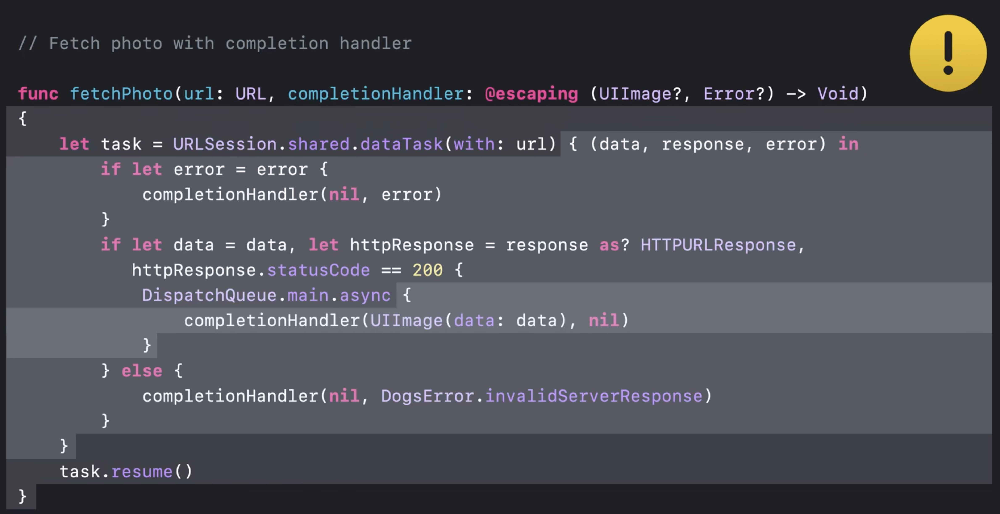

# Use async/await with URLSession

Presenters:
- Guoye Zhang, Internet Technologies Engineer
- Zhenchao Li, Internet Technologies Engineer

Networking is inherently async, and Apple has introduced a set of new APIs in
URLSession to take advantage of Swift concurrency features

## Replacing completionHandlers with `async`/`await`

Existing code that fetches a dog photo:

```
// Fetch photo with completion handler

func fetchPhoto(url: URL, completionHandler: @escaping (UIImage?, Error?) -> Void)
{
    let task = URLSession.shared.dataTask(with: url) { (data, response, error) in
        if let error = error {
            completionHandler(nil, error)
        }   
        if let data = data, let httpResponse = response as? HTTPURLResponse,
            httpResponse.statusCode == 200 {
              DispatchQueue.main.async {
                  completionHandler(UIImage(data: data), nil)
              }
        } else {
            completionHandler(nil, DogsError.invalidServerResponse)
        }
    }
    task.resume()
}
```

This code seems straightforward, but has at least three mistakes.

Control flow jumps around, and is difficult to follow. What about threading?
- 3 Different execution contexts in total
  - The ? layer runs on whatever thread or queue of the caller
  - URLSession task completion handler runs on sessions delegate queue
  - The final completion handler runs on the main queue



Issues:
1. The calls to the completionHandler are not consistently dispatched to the main
   queue. This could be a bug.
2. We're missing an early return at `completionHandler(nil, error)`. The completionHandler
   can be called twice if you got an error. This could violate assumptions made
   by the caller.
3. It might not be obvious, but UIImage creation can fail. If the data is in an
   incorrect format, this UIImage initializer returns nil, so we would have called
   the completionHandler with both nil image and nil error. That is likely not
   expected.

Now an example with async/await:

```
// Fetch photo with async/await

func fetchPhoto(url: URL) async throws -> UIImage
{
    let (data, response) = try await URLSession.shared.data(from: url)

    guard let httpResponse = response as? HTTPURLResponse,
          httpResponse.statusCode == 200 else {
        throw DogsError.invalidServerResponse
    }

    guard let image = UIImage(data: data) else {
        throw DogsError.unsupportedImage
    }

    return image
}
```

It's much easier to read. Control flow is linear. We know that everything in this
function runs in the same concurrency context, so we no longer need to worry about
threading issues.

New async data method on URLSession. It suspends the current execution context
without blocking, and returns data in response on successful completion, or
throws an error.

`let (data, response) = try await URLSession.shared.data(from: url)`

We used the `throw` keyword to throw errors when the response is unexpected. This
allows the caller to catch and handle errors using Swift's native error handling.

`throw DogsError.invalidServerResponse` and `throw DogsError.unsupportedImage`

Last, the compiler would 'bark' if you tried to return an optional image from this
function, so it essentially forces us to handle correctly

New:
- `URLSession.data`
- `URLSession.upload`
- `URLSession.download`
- `URLSession.bytes`

Swift concurrency cancellation works with URLSession:
- Create an explicit `Task.Handle`, and `handle.cancel()`

See also:
- Meet AsyncSequence

## URLSessionTask-specific delegates

URLSession is designed around a delegate model that provides callbacks for events,
such as authentication challenges, metrics, and more. The new async methods no
longer expose the underlying tasks, so how do we handle authentication challenges
specific to our task?

All of the methods can take an additional argument, a task-specific delegate,
allowing you to provide an object to handle delegate methods specific to this
data, upload, download, or byte operation

URLSessionTask-specific delegate

```
func data(from url: URL, delegate: URLSessionTaskDelegate?)
func data(for request: URLRequest, delegate: URLSessionTaskDelegate?)

func upload(for request: URLRequest, fromFile url: URL, delegate: URLSessionTaskDelegate?)
func upload(for request: URLRequest, from data: Data, delegate: URLSessionTaskDelegate?)

func download(from url: URL, delegate: URLSessionTaskDelegate?)
func download(for request: URLRequest, delegate: URLSessionTaskDelegate?)
func download(resumeFrom resumeData: Data, delegate: URLSessionTaskDelegate?)

func bytes(from url: URL, delegate: URLSessionTaskDelegate?)
func bytes(for request: URLRequest, delegate: URLSessionTaskDelegate?)
```

Objc:
```
@interface NSURLSessionTask : NSObject

@property (nullable) id <NSURLSessionTaskDelegate> delegate;

@end
```

- Swift and Objective-C
- Strongly referenced until task completion
- Not supported on background URLSession
- Higher precedence than session delegate

Example for authorization challenges:

```
class AuthenticationDelegate: NSObject, URLSessionTaskDelegate {
    private let signInController: signInController

    init(signInController: SignInController) {
        self.signInController = signInController
    }

    func urlSession(_ session: URLSession,
                      task: URLSessionTask,
                      didReceive challenge: URLAuthenticationChallenge) async
    -> (URLSession.AuthChallengeDisposition, URLCredential?) {
        if challenge.protectionSpace.authenticationMethod == NSURLAuthenticationMethodHTTPBasic {
            do {
                let (username, password) = try await signInController.promptForCredential()
                return (.useCredential,
                        URLCredential(user: username,
                                      password: password,
                                      persistence: .forSession))
            } catch {
                return (.cancelAuthenticationChallenge, nil)
            }
        } else {
            return (.performDefaultHandling, nil)
        }
    }
}
```

To instantiate an instance of it and pass it as the delegate to the
`URLSession.data` method:

```
private func sync() async throws {
    let request = URLRequest(url: endpoint)
    let (data, response) = try await mainURLSession.data(for: request, delegate:
        AuthenticationDelegate(signInController: signInController))
    guard let response = response as? HTTPURLResponse, response.statusCode == 200 else {
        throw DogsError.invalidServerResponse
    }

    let photos = try JSONDecoder().decode([PhotoMetadata].self, from: data)

    await updatePhotos(photos)
}
```

Note the delegate object is not an instance variable, and it's strongly held by
the task until the task completes or fails. What's new here is that the delegate
can be used to handle events that are specific to an instance of a URLSessionTask,
which is handy when the logic inside your delegate methods only applies to a
certain URLSessionTask and not others.

## Summary

Adopt URLSession `async` methods
Apply async concepts to your code
- Completion handler -> `async` function
- Events handler -> `AsyncSequence`

To learn more:
- Analyze HTTP traffic in Instruments
- Accelerate networking with HTTP/3 and QUIC
